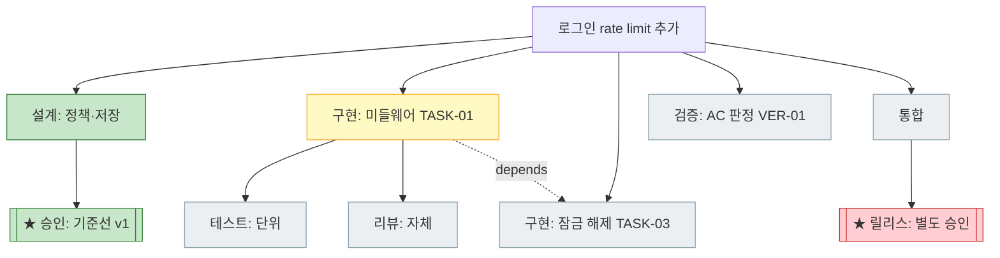

# 작업 계획 트리 스킬 작업 정의 (wf-tree)

> 상태: 반영됨
> 작성일: 2026-08-08

> **이 문서는 기획 기록입니다.** 스킬 정본은 [skills/wf-tree/SKILL.md](./skills/wf-tree/SKILL.md)이며, 내용이 다르면 스킬을 따릅니다.

## 요약

작업 계획을 분기마다 가지가 생기는 트리로 수립하고, 노드 유형별로 빠지기 쉬운 action item을 자동 제안하며, 전체 계획과 진행 상태를 화면에 시각화하는 스킬을 정의한다.

트리는 계획의 새로운 원천이 아니라 기존 계획 문서(wf-doc `plan` 유형)의 구조화·시각화 계층이다. 어떤 항목이 존재하고 완료되었는지는 wf-design과 wf-implement가 결정하며, 이 스킬은 **제안하되 결정하지 않는다**.

## 관련 문서

- [Human–AI Development Workflow](./README.md)
- [wf-design](./skills/wf-design/SKILL.md)
- [wf-implement](./skills/wf-implement/SKILL.md)
- [wf-doc](./skills/wf-doc/SKILL.md)
- 선례 패턴: [코드 역공학 작업 정의](./CODE_REVERSE_ENGINEERING_TASKS.md) — 기획 문서 → wf-design 검토 → 스킬화 경로

## 전체 구조 — 하이브리드 2계층 트리

트리는 두 계층으로 구성한다.

- **상위 계층(포트폴리오):** 노드 = 작업(작업 ID) 1개. 큰 목표가 작업들로 분해되는 구조를 보여준다.
- **하위 계층(작업 내부):** 노드 = action item(설계·구현·리뷰·테스트 등). 각 작업이 통과하는 단계와 실행 단위를 보여준다.

```text
[포트폴리오] 인증 시스템 개선 (PF-auth-improvement)
├─ [작업] 20260808-login-rate-limit ......... in-progress (3/7)
│   ├─ [✓] 설계: 정책·저장 방식               ← 여기부터 action item 계층
│   ├─ [✓] 승인: 기준선 v1
│   ├─ [▶] 구현: 미들웨어 (TASK-01)
│   │   ├─ [ ] 테스트: 단위
│   │   └─ [ ] 리뷰: 자체 리뷰
│   └─ [ ] 검증: AC 판정 (VER-01)
├─ [작업] 20260815-session-store ............ pending  depends: rate-limit
└─ [작업] 20260820-2fa ...................... pending
```

작업이 하나뿐이면 포트폴리오 계층을 생략하고 작업을 루트로 사용할 수 있다.

### 포트폴리오 생성과 갱신

- **최초 생성:** 사용자 승인 관문을 거친다(범위 승인). 어떤 목표를 어떤 작업들로 나눌지가 승인 대상이다.
- **이후 갱신:** 작업 추가·제거, 상태 반영, 트리 재구성은 승인 없이 자동으로 진행한다.
- 자동 갱신은 포트폴리오 **표현**에 한정된다. 개별 작업의 기준선 승인 관문([wf-design §8](./skills/wf-design/SKILL.md#8-사용자-승인-관문))과 외부·비가역 작업의 별도 승인([wf-implement §2.3](./skills/wf-implement/SKILL.md#23-자율-진행과-승인))을 대체하지 않는다.

## 트리 의미론

- **루트** = 포트폴리오 또는 단일 작업
- **가지(분기)** = 작업 또는 항목이 나뉘는 지점. 두 종류를 구분한다.
  - **AND-분기** (기본): 분해 — 모든 자식이 완료돼야 부모가 완료된다.
  - **OR-분기**: 대안 경쟁 — `결정(ADR)` 노드가 해소하며, 기각된 대안도 삭제하지 않고 흐리게 보존한다.
- **잎** = action item. 하나의 명확한 결과와 완료 조건을 가진 실행 단위([wf-implement 계획 수립](./skills/wf-implement/SKILL.md#32-계획-수립)과 동일 기준).
- **부모-자식 ≠ 의존성:** 부모-자식은 *분해* 관계이고, `depends:`는 *순서* 제약이다. 트리로 표현할 수 없는 가지 간 의존은 `depends:` 주석과 점선 간선으로 표현한다. 이는 트리 구조의 알려진 한계로 명시한다.

## 노드 유형

| 유형 | 설명 | 기존 생태계 매핑 |
|---|---|---|
| `investigate` 조사 | 현재 상태 조사, 역공학, 재현 | [wf-design §4.1](./skills/wf-design/SKILL.md#41-현재-상태-조사), [역공학 절차](./skills/wf-design/references/reverse-engineering.md) |
| `design` 설계 | 구조·계약·데이터 설계 | `DES-NN` |
| `decide` 결정 | 대안 비교·선택. OR-분기의 해소 지점 | `ADR-NNN` |
| `approve` 승인 ★ | 사용자 승인 관문 (기준선·외부 작업) | `APR`, [wf-design §8](./skills/wf-design/SKILL.md#8-사용자-승인-관문) |
| `prototype` 실험 | 가설 검증용 임시 구현 (폐기 전제) | [프로토타입 규칙](./skills/wf-design/SKILL.md#1-적용-시점) |
| `implement` 구현 | 코드·테스트·설정 변경 | `TASK-NN` |
| `test` 테스트 | 구현 활동으로서의 테스트 작성·실행 | [wf-implement §3.4](./skills/wf-implement/SKILL.md#34-검증) 1~3단계 |
| `review` 리뷰 | 설계 일관성 검토 / 구현 자체 리뷰 | [wf-design §4.5](./skills/wf-design/SKILL.md#45-일관성-검토), [wf-implement §3.5](./skills/wf-implement/SKILL.md#35-자체-리뷰) |
| `verify` 검증 | 인수 조건 판정 (test와 구분: AC 기준 판정) | `VER-NN` ↔ `AC-NN` |
| `document` 문서화 | 요구사항·설계·운영 문서 갱신 | [wf-doc](./skills/wf-doc/SKILL.md) |
| `integrate` 통합 | 빌드·회귀·일관 반영 | [wf-implement §3.6](./skills/wf-implement/SKILL.md#36-통합) |
| `migrate` 전환 | 데이터·설정 마이그레이션 + 롤백 준비 | [wf-implement §3.2](./skills/wf-implement/SKILL.md#32-계획-수립) |
| `release` 릴리스 ★ | push·PR·배포 — 외부·비가역, 별도 승인 필수 | [wf-implement §2.3](./skills/wf-implement/SKILL.md#23-자율-진행과-승인) |
| `change` 설계 변경 | 구현 중 기준선 충돌 시 DCR 분기 | `DCR-NNN`, [DCR 절차](./skills/wf-design/references/design-change.md) |
| `question` 질문/차단 | 사용자 답변·외부 요인 대기 | `Q-NN`, `blocked` |

## 분기 템플릿 — 누락 항목 자동 제안

노드를 추가하면 유형별로 표준 자식을 **제안**한다. 채택 여부는 내용 소유자와 사용자가 결정하며, 제안 규칙은 전부 기존 워크플로우 규칙에서 파생된다.

| 트리거 | 자동 제안되는 자식 | 근거 규칙 |
|---|---|---|
| `design` 노드 생성 | `review`(일관성 검토) + `approve`(승인 관문) | wf-design §4.5, §8 |
| 대안이 2개 이상 경쟁 | `decide`(ADR) OR-분기 | wf-design §3.3 |
| `implement` 노드 생성 | `test` + `review`(자체 리뷰) | wf-implement §2.4, §3.5 |
| 공개 인터페이스·계약 변경 | `document` + `verify`(호환성) | wf-implement §3.3 |
| `migrate` 노드 생성 | 롤백 준비 + `verify` **필수** | wf-implement §3.2 |
| `release` 노드 생성 | 부모에 `approve`(외부 작업 승인) **필수 게이트** | wf-implement §2.3 |
| 구현 중 기준선 충돌 감지 | `change`(DCR) 분기 + 영향 서브트리 보류 표시 | wf-implement §4.2 |
| 신뢰 경계의 입력 처리 | `test`(보안 케이스) | wf-implement §2.4 최소화 예외 영역 |
| 포트폴리오 최초 생성 | `approve`(범위 승인) **필수 게이트** | 이 문서 결정 기록 Q-02 |

## 식별자와 데이터 모델

### 평면 ID + 상위 필드

계층을 ID에 박아 넣는 점 표기(`TASK-01.2`)는 사용하지 않는다. 트리 재구성 시 ID가 바뀌어 wf-doc의 식별자 안정성 원칙과 충돌하고 기존 링크를 깨뜨리기 때문이다. 대신 평면 ID를 유지하고 부모 참조 필드를 추가한다.

```markdown
### TASK-03: 잠금 해제 정책
- 상위: TASK-01      ← 새 필드: 분해 관계 (트리는 이 필드에서 파생)
- 의존성: TASK-02    ← 기존 필드: 순서 제약
```

### 포트폴리오 식별자

작업 상위 단위로 `PF-<슬러그>` 식별자를 신설한다. 포트폴리오 문서는 `docs/work/PF-<슬러그>/portfolio.md`에 둔다.

### 단일 소스 원칙

진실의 원천은 계획 문서의 항목 목록 하나다. 트리는 `상위:` 필드에서 파생되고, 다이어그램은 목록에서 매번 재생성한다. 생성된 다이어그램에는 `<!-- generated -->` 표시를 두고 손으로 고치지 않는다. 다이어그램과 목록이 다르면 목록이 맞다.

## 상태 모델

- 새 상태 어휘를 발명하지 않고 [wf-doc 상태값](./skills/wf-doc/SKILL.md#24-상태-기록)을 재사용한다: `pending`(트리 표시용) / `in-progress` / `completed` / `blocked`, 승인 노드는 `awaiting-approval` / `approved` / `rejected` / `on-hold`.
- 부모 노드의 집계(`3/7 완료`, `⚠ blocked 1`)는 **표시 전용 롤업**이다. wf-doc의 "실제 사건 없이 상태를 자동 전이하지 않는다" 규칙에 따라, 집계가 문서의 상태 필드를 자동으로 바꾸지 않는다. 부모의 실제 완료 판정은 내용 소유자가 한다.

## 시각화

### 매체 — ASCII + Mermaid 2종

| 매체 | 역할 |
|---|---|
| Markdown 목록 | 진실의 원천. AI가 Edit로 직접 수정, diff·git 친화 |
| ASCII 트리 | 터미널 기본 출력. 어디서나 렌더 (Codex 포함) |
| Mermaid | 계획 문서 안에 생성물로 삽입. VSCode 미리보기·GitHub 렌더 |

HTML Artifact는 1차 범위에서 **제외**한다. 저장소 밖 산출물이라 git 추적이 안 되어 단일 소스 원칙과 어긋나고, Codex 환경에서 불가하여 이식성 원칙을 위반하며, 완료마다 자동 재렌더와 결합하면 재발행 부담이 크다. 대형 트리 가독성은 아래 규칙으로 해결한다. 필요가 확인되면 "요청 시에만 발행하는 열람용 보조"로 후속 검토한다.

Mermaid 예시 (작업 상세 뷰):



### 갱신 시점

각 작업 완료마다 자동으로 재렌더한다. 배선 지점은 [wf-implement 계획 수립](./skills/wf-implement/SKILL.md#32-계획-수립)의 "계획의 진행 상태는 작업 중 갱신한다"이며, 상태 갱신과 트리 재생성을 한 동작으로 묶어 이중 소스 위험을 줄인다.

### 대형 트리 대응 — 깊이 무제한

깊이를 제한하지 않는 대신 "전부 보여주되 전부 펼치지 않는다"를 적용한다.

1. **완료 서브트리 자동 접기** — 완료된 가지는 `[✓] 설계 단계 (4/4)` 한 줄로 요약. 펼침은 요청 시.
2. **활성 경로 중심 뷰(기본값)** — 루트→진행 중 노드 경로만 전체 깊이로 펼치고 나머지 가지는 깊이 1 요약. 세션 재개 시 "지금 어디"가 즉시 보인다.
3. **계층별 다이어그램 분할** — 포트폴리오 뷰(작업 노드만)와 작업별 상세 뷰를 별도 Mermaid로 생성. 하나의 다이어그램이 **노드 30을 초과하면 분할**한다. 트리가 커지면 다이어그램 수가 늘지 노드 밀도가 늘지 않는다.
4. **ASCII 필터** — 전체 / 진행 중 경로만 / 남은 항목만 / 특정 가지만.
5. **롤업 배지** — 접힌 가지에도 `(완료/전체)`와 `⚠ blocked N`을 병기해 상태 손실을 막는다.

## 기존 워크플로우와의 경계

| 영역 | 소유 |
|---|---|
| 어떤 항목이 존재하고 완료됐는지 (의미·상태 전이) | [wf-design](./skills/wf-design/SKILL.md)(설계·승인) / [wf-implement](./skills/wf-implement/SKILL.md)(구현·검증) — 변경 없음 |
| 트리 구조 규칙, 노드 유형, 분기 템플릿, 렌더링 | 이 스킬 |
| 계획 문서의 Markdown 형식·식별자·상태 어휘 | [wf-doc](./skills/wf-doc/SKILL.md) — 재사용 |

이 스킬의 헌장: **제안하되 결정하지 않는다.** 분기 템플릿은 후보를 제안할 뿐, 채택·완료 판정·상태 전이는 내용 소유자와 사용자의 것이다. 트리에 항목을 추가하는 것이 요구사항·설계·계획을 승인하는 것을 대신하지 않는다.

## wf-doc 확장 필요 항목

스킬화와 함께 다음 확장이 wf-doc에 반영되었다.

- 계획 항목의 `상위:` 필드 — [구현 계획 템플릿](./skills/wf-doc/references/templates.md#구현-계획-plan)에 추가됨
- `PF-<슬러그>` 포트폴리오 식별자와 [`portfolio` 문서 유형·템플릿](./skills/wf-doc/references/templates.md#포트폴리오-portfolio) 추가됨
- 표시 전용 롤업 표기는 wf-doc이 아니라 [wf-tree 렌더링 규칙](./skills/wf-tree/SKILL.md#7-렌더링)이 소유하는 것으로 정리됨 (생성물이므로 문서 필드가 아님)

## 스킬화 시 배치

**독립 경량 스킬 `wf-tree`를 권장한다.** 이 권장안은 사용자 승인으로 확정되어 [skills/wf-tree/SKILL.md](./skills/wf-tree/SKILL.md)로 반영되었다.

- wf-doc 참조로 만들면: 시각화는 표현이라 적합하지만, 분기 템플릿은 내용 *제안*이라 wf-doc 헌장("내용을 결정하지 않는다")과 충돌한다.
- wf-implement 참조로 만들면: 계획 수립 확장으로 자연스럽지만 설계 단계 노드(승인·ADR)와 포트폴리오 계층까지 포함해 범위를 초과한다.
- 독립 스킬로 만들면: 두 워크플로우에 걸친 횡단 계층이라 유일하게 범위가 맞다. 경계쌍 부담은 "제안하되 결정하지 않는다" 헌장으로 좁게 유지한다.

## 결정 기록

기획 단계의 미해결 질문은 사용자 결정으로 모두 해소되었다.

| 질문 | 결정 (2026-08-08, 사용자) |
|---|---|
| Q-01 포트폴리오 문서 저장 위치 | `docs/work/PF-<슬러그>/portfolio.md`로 확정 |
| Q-02 포트폴리오 승인 관문 | 최초 생성 시 범위 승인 필요, 이후 갱신은 자동 진행. 작업별 기준선 승인과 외부·비가역 작업 승인은 그대로 유지 |
| Q-03 Mermaid 분할 임계값 | 사용자 지정 범위 30~35 중 엄격한 값인 **노드 30 초과 시 분할** 채택 |
| Q-04 스킬 이름 | **`wf-tree`** — 스킬이 소유하는 것(트리 구조·시각화)을 정확히 표현. `wf-plan`은 계획 *내용*을 소유한다는 오해로 wf-implement §3.2와 트리거가 겹칠 위험이 있어 기각, `wf-roadmap`은 일정 관리로 오해될 수 있어 기각 |

## 완료 조건

다음 조건을 모두 만족하면 이 기획을 wf-design 검토·스킬화로 진행할 수 있다.

- 하이브리드 2계층 모델과 노드 유형 분류가 확정되어 있다.
- 식별자 규칙(평면 ID + 상위 필드, PF- 신설)이 wf-doc 확장 항목으로 정리되어 있다.
- 렌더링 규칙(매체 2종, 재렌더 시점, 대형 트리 대응, 단일 소스)이 정의되어 있다.
- 경계와 헌장이 기존 스킬의 소유권과 모순되지 않는다.
- 배치(독립 스킬 권장)가 wf-design 검토에서 결정되었다. — 충족: 사용자 승인 (2026-08-08)
- 미해결 질문이 답변되었거나 1차 범위에서 명시적으로 제외되었다. — 충족: [결정 기록](#결정-기록) 참조

이 문서는 작업 계획 트리 스킬의 범위와 원칙을 정리한 기획 기록이다. 스킬 정본은 [skills/wf-tree/SKILL.md](./skills/wf-tree/SKILL.md)다.
