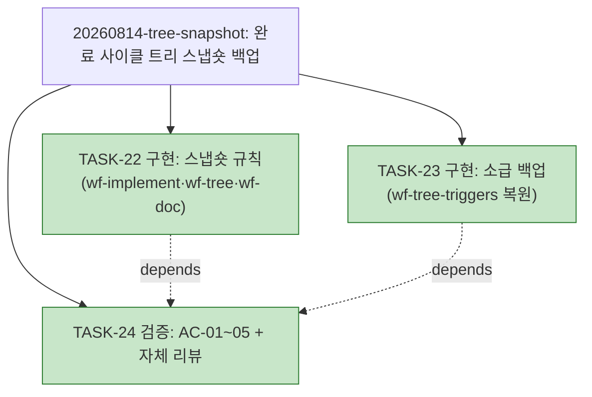

# PLAN-llm-workflow: 구현 계획

> 문서 유형: `plan`
> 작업 ID: `20260814-tree-snapshot`
> 상태: `completed`
> 기준선: `v1` ([REQ-DESIGN-tree-snapshot](./work/20260814-tree-snapshot/req-design.md), 2026-08-14 승인)
> 작성일: 2026-08-09
> 최종 갱신: 2026-08-14
> 관련 문서: [REQ-DESIGN-tree-snapshot: 요구사항·설계](./work/20260814-tree-snapshot/req-design.md), [WORK-20260814-tree-snapshot: 작업 기록](./work/20260814-tree-snapshot/work-log.md)

## 요약

- 목적: 승인된 기준선 v1에 따라 완료 사이클 계획 트리 스냅숏 백업 규칙(스킬 문서 3개)과 소급 백업 2건을 구현·검증한다.
- 현재 결론 또는 상태: **사이클 완료** — TASK-22~24 전부 완료, AC-01~05 전 항목 성공. 상세·검증은 [작업 기록](./work/20260814-tree-snapshot/work-log.md)의 완료 보고 참조.
- 다음 행동: 없음 — 커밋 `3eea58d`·푸시(origin/main)로 종결(2026-08-14).

## 문서 연결

| 방향 | 관계 | 대상 문서 | 대상 항목 | 비고 |
|---|---|---|---|---|
| input | baseline | [REQ-DESIGN-tree-snapshot](./work/20260814-tree-snapshot/req-design.md) | FR-01~05, NFR-01~02, AC-01~05, DES-01~05 | 승인 기준선 v1 |
| output | implementation | [WORK-20260814-tree-snapshot: 작업 기록](./work/20260814-tree-snapshot/work-log.md) | document | 진행 상태·검증의 정본 |
| input | related | [WORK-20260809-claude-hooks](./work/20260809-claude-hooks/work-log.md), [WORK-20260809-dev-briefing](./work/20260809-dev-briefing/work-log.md), [WORK-20260814-wf-tree-triggers](./work/20260814-wf-tree-triggers/work-log.md), [WORK-20260814-id-item-tables](./work/20260814-id-item-tables/work-log.md) | document | 완료된 이전 사이클(아래 축약). 뒤 2건은 이번 소급 백업 대상 |

## 작업 정의

- 목표: 완료 사이클의 계획 트리 표현(ASCII 상세+mermaid)을 work-log에 스냅숏으로 이관하는 규칙을 스킬 3개에 신설하고, 소급 백업 2건을 수행하며, AC-01~05로 검증한다.
- 범위·범위 밖·가정·위험: [기준선 문서](./work/20260814-tree-snapshot/req-design.md) 참조.
- 트리 사용 결정: **사용** — 작업 3개(3개 이상)이고 TASK-24가 TASK-22·23에 의존하므로 채택 기준을 충족한다.

## 계획 트리

<!-- generated -->

```text
PLAN-llm-workflow
├─ [✓] 20260809-claude-hooks ........... completed (6/6, TASK-01~06)
├─ [✓] 20260809-dev-briefing ........... completed (9/9, TASK-07~15)
├─ [✓] 20260814-wf-tree-triggers ....... completed (4/4, TASK-16~19)
├─ [✓] 20260814-id-item-tables ......... completed (2/2, TASK-20~21)
└─ [✓] 20260814-tree-snapshot .......... completed (3/3)
    ├─ [✓] TASK-22 구현: 스냅숏 규칙 (wf-implement·wf-tree·wf-doc)
    ├─ [✓] TASK-23 구현: 소급 백업 (wf-tree-triggers 복원)
    └─ [✓] TASK-24 검증: AC-01~05 기계 확인 + 자체 리뷰   depends: TASK-22·23
```



## 작업 목록

완료된 이전 사이클 (상세는 각 작업 기록이 정본):

- [x] TASK-01~06 — C층 훅 3종 + 설치 (작업 `20260809-claude-hooks`, [작업 기록](./work/20260809-claude-hooks/work-log.md))
- [x] TASK-07~15 — 발표 자료 md→pptx, 디자인·인포그래픽 (작업 `20260809-dev-briefing`, [작업 기록](./work/20260809-dev-briefing/work-log.md)): TASK-07 md 초판 / TASK-08 내용 검토 관문 / TASK-09 테스트(Red) / TASK-10 구현(Green) / TASK-11 생성·검증 / TASK-13 디자인 테스트(Red) / TASK-14 렌더러(Green) / TASK-15 재생성·검증 / TASK-12 최종 검토 관문 — 전부 completed
- [x] TASK-16~19 — wf-tree 트리거 신설(스킬 문서 3개) (작업 `20260814-wf-tree-triggers`, [작업 기록](./work/20260814-wf-tree-triggers/work-log.md)): TASK-16 wf-implement 트리거·완료 조건·용어 / TASK-17 wf-doc 템플릿 / TASK-18 wf-tree 적용 시점·description / TASK-19 검증 AC-01~06 — 전부 completed
- [x] TASK-20~21 — wf-doc 템플릿 ID 발행 항목 표 형식 (작업 `20260814-id-item-tables`, [작업 기록](./work/20260814-id-item-tables/work-log.md)): TASK-20 templates.md 표 골격·노트 / TASK-21 검증 AC-01~04 — 전부 completed

현재 사이클 (작업 `20260814-tree-snapshot`):

### TASK-22: 스냅숏 규칙 수정

- 상태: completed
- 상위: 없음
- 목표: 스킬 문서 3개 수정 — wf-implement §7 축약 문단에 완료 시 스냅숏(FR-01)·축약 전제와 보정 경로(FR-02) 반영과 §5 완료 조건 항목 추가, wf-tree §5 단일 소스 원칙에 스냅숏 동결·표시 규칙(FR-03·NFR-01), wf-doc work-log 템플릿 노트에 스냅숏 절 배치·표기(FR-04)
- 관련 요구사항과 설계: FR-01~04, NFR-01~02, DES-01·02·03
- 변경 대상: `skills/wf-implement/SKILL.md`, `skills/wf-tree/SKILL.md`, `skills/wf-doc/references/templates.md`
- 의존성: 없음
- 위험: RISK-01(스냅숏을 generated로 오인) — 동결 표시 규칙으로 완화
- 검증 방법: TDD 부적용(산문 문서, 테스트 체계 없음 — 사유는 작업 기록에 기록, 후행 검증으로 대체). AC-01~03 기계 확인은 TASK-24
- 완료 조건: DES-01 배치대로 세 문서 반영, 변경 대상 절 밖 의미 불변(NFR-02)

### TASK-23: 소급 백업

- 상태: completed
- 상위: 없음
- 목표: `20260814-wf-tree-triggers` work-log에 커밋 `13e4a72`의 완료 시점 트리(ASCII 서브트리+mermaid)를 DES-02 형식으로 복원. `20260814-id-item-tables` 스냅숏은 계획 수립 변경에서 FR-02 보정 경로로 선백업됨 — 사실 확인만 기록
- 관련 요구사항과 설계: FR-05, DES-02·04
- 변경 대상: `docs/work/20260814-wf-tree-triggers/work-log.md`
- 의존성: 없음 (스냅숏 형식은 기준선 DES-02가 정의)
- 검증 방법: 원본(git show `13e4a72`) 대조는 TASK-24(AC-04)
- 완료 조건: 스냅숏 존재·원본 일치, 소급 사유 표기(DES-04)

### TASK-24: 검증과 자체 리뷰

- 상태: completed
- 상위: 없음
- 목표: AC-01~03 기계 확인(세 문서 해당 절 통독), AC-04 원본 대조, AC-05 자기 적용 증거(이 사이클 완료 보고 시 이 작업 work-log에 스냅숏 생성 관찰), wf-implement §3.5 자체 리뷰, 작업 기록에 검증 표(VER-01~05) 기록
- 관련 요구사항과 설계: AC-01~05, NFR-01~02
- 변경 대상: `docs/work/20260814-tree-snapshot/work-log.md` (검증 기록)
- 의존성: TASK-22, TASK-23
- 검증 방법: 통독·대조 결과를 검증 표(VER-01~05)로 기록
- 완료 조건: 전 AC 판정 기록, 자체 리뷰 통과

의존성 요약: TASK-22·23(독립, 병행 가능) → TASK-24(검증).

## 검증 계획

AC-01~03은 TASK-22의 변경을 TASK-24에서 통독으로 판정한다. AC-04는 TASK-23의 스냅숏(및 계획 수립 시 선백업된 id-item-tables 스냅숏)을 원본과 대조한다. AC-05는 이 사이클의 완료 보고 자체가 증거 — 완료 시 신설 규칙의 자기 적용으로 [이 작업의 work-log](./work/20260814-tree-snapshot/work-log.md)에 스냅숏이 생성되는지 관찰한다. 결과는 [작업 기록](./work/20260814-tree-snapshot/work-log.md#검증)에 기록한다.

## 마이그레이션과 롤백

소급 백업 2건(FR-05)은 완료된 work-log에 대한 기록 보완이며 완료 판정·의미를 바꾸지 않는다(DES-04). 스킬 문서는 텍스트 수정만 수행하고 설치본은 정션 링크라 별도 배포 없음. 롤백은 git revert로 충분.

## 인계

작업 기록 [WORK-20260814-tree-snapshot](./work/20260814-tree-snapshot/work-log.md)의 인계 절이 정본이다.
