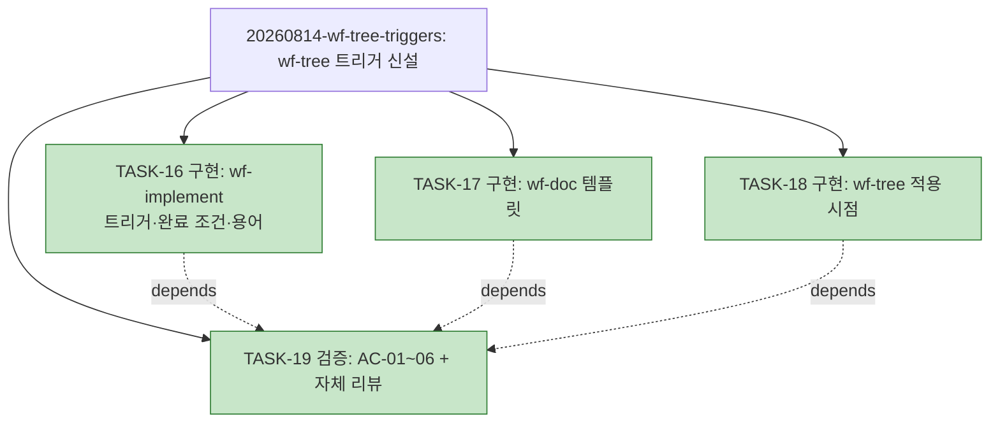

# PLAN-llm-workflow: 구현 계획

> 문서 유형: `plan`
> 작업 ID: `20260814-wf-tree-triggers`
> 상태: `completed`
> 기준선: `v1` ([REQ-DESIGN-wf-tree-triggers](./work/20260814-wf-tree-triggers/req-design.md), 2026-08-14 승인, [ADR-003](./work/20260814-wf-tree-triggers/ADR-003-트리거-단일-관문.md))
> 작성일: 2026-08-09
> 최종 갱신: 2026-08-14
> 관련 문서: [REQ-DESIGN-wf-tree-triggers: 요구사항·설계](./work/20260814-wf-tree-triggers/req-design.md), [WORK-20260814-wf-tree-triggers: 작업 기록](./work/20260814-wf-tree-triggers/work-log.md)

## 요약

- 목적: 승인된 기준선 v1에 따라 wf-tree 트리거 신설(스킬 문서 3개 수정)을 구현·검증한다.
- 현재 결론 또는 상태: **사이클 완료** — TASK-16~19 전부 완료, AC-01~06 전 항목 성공. 상세·검증은 [작업 기록](./work/20260814-wf-tree-triggers/work-log.md)의 완료 보고 참조.
- 다음 행동: 없음 — 완료 기록 커밋으로 종결.

## 문서 연결

| 방향 | 관계 | 대상 문서 | 대상 항목 | 비고 |
|---|---|---|---|---|
| input | baseline | [REQ-DESIGN-wf-tree-triggers](./work/20260814-wf-tree-triggers/req-design.md) | FR-01~07, AC-01~06, DES-01~05 | 승인 기준선 v1 |
| input | decision | [ADR-003: 계획 트리 트리거의 단일 관문 배치](./work/20260814-wf-tree-triggers/ADR-003-트리거-단일-관문.md) | document | 트리거 배치 결정 |
| output | implementation | [WORK-20260814-wf-tree-triggers: 작업 기록](./work/20260814-wf-tree-triggers/work-log.md) | document | 진행 상태·검증의 정본 |
| input | related | [WORK-20260809-claude-hooks](./work/20260809-claude-hooks/work-log.md), [WORK-20260809-dev-briefing](./work/20260809-dev-briefing/work-log.md) | document | 완료된 이전 사이클(아래 축약) |

## 작업 정의

- 목표: `skills/` 스킬 문서 3개에 계획 트리 트리거를 신설하고 AC-01~06으로 검증한다.
- 범위·범위 밖·가정·위험: [기준선 문서](./work/20260814-wf-tree-triggers/req-design.md) 참조.
- 트리 사용 결정: **사용** — 작업 4개(3개 이상)이고 TASK-19가 TASK-16~18에 의존하므로 기준선 FR-01의 채택 기준을 충족한다(신설 규칙의 자기 적용, AC-06).

## 계획 트리

<!-- generated -->

```text
PLAN-llm-workflow
├─ [✓] 20260809-claude-hooks ........... completed (6/6, TASK-01~06)
├─ [✓] 20260809-dev-briefing ........... completed (9/9, TASK-07~15)
└─ [✓] 20260814-wf-tree-triggers ....... completed (4/4)
    ├─ [✓] TASK-16 구현: wf-implement 트리거·완료 조건·용어
    ├─ [✓] TASK-17 구현: wf-doc 템플릿 (plan 노트·죽은 필드)
    ├─ [✓] TASK-18 구현: wf-tree 적용 시점·description
    └─ [✓] TASK-19 검증: AC-01~06 기계 확인 + 자체 리뷰   depends: TASK-16~18
```



## 작업 목록

완료된 이전 사이클 (상세는 각 작업 기록이 정본):

- [x] TASK-01~06 — C층 훅 3종 + 설치 (작업 `20260809-claude-hooks`, [작업 기록](./work/20260809-claude-hooks/work-log.md))
- [x] TASK-07~15 — 발표 자료 md→pptx, 디자인·인포그래픽 (작업 `20260809-dev-briefing`, [작업 기록](./work/20260809-dev-briefing/work-log.md)): TASK-07 md 초판 / TASK-08 내용 검토 관문 / TASK-09 테스트(Red) / TASK-10 구현(Green) / TASK-11 생성·검증 / TASK-13 디자인 테스트(Red) / TASK-14 렌더러(Green) / TASK-15 재생성·검증 / TASK-12 최종 검토 관문 — 전부 completed

현재 사이클 (작업 `20260814-wf-tree-triggers`):

### TASK-16: wf-implement 트리거·완료 조건·용어 수정

- 상태: completed
- 상위: 없음
- 목표: `skills/wf-implement/SKILL.md` — §3.2에 트리 채택 결정(FR-01 기준)·최초 생성·재생성 문단 반영, §5 완료 조건에 동기화 항목 추가, git working tree 의미의 "작업 트리" 표현 전수 치환(경계표·§3.6 등)
- 관련 요구사항과 설계: FR-01·02·03·06, DES-02·03(1~3)
- 변경 대상: `skills/wf-implement/SKILL.md`
- 의존성: 없음
- 위험: 산문 규칙이라 자동 회귀 검증 불가(RISK-02) — TASK-19 기계 확인으로 보완
- 검증 방법: TDD 부적용(산문 문서, 테스트 체계 없음 — 사유를 작업 기록에 남기고 후행 검증 대체). AC-01·02·04 기계 확인은 TASK-19
- 완료 조건: DES-03(1~3)의 세 수정이 반영되고 변경 대상 절 밖 의미 불변

### TASK-17: wf-doc 템플릿 수정

- 상태: completed
- 상위: 없음
- 목표: `skills/wf-doc/references/templates.md` — plan 템플릿 노트에 "트리 사용 여부는 wf-implement 계획 수립이 결정" 링크 문장 추가, work-log 템플릿의 `작업 트리 상태:` 필드 제거
- 관련 요구사항과 설계: FR-04·05, DES-03(4)·04
- 변경 대상: `skills/wf-doc/references/templates.md`
- 의존성: 없음
- 검증 방법: TDD 부적용(동일 사유). AC-03 기계 확인은 TASK-19
- 완료 조건: 두 수정 반영, 다른 템플릿 의미 불변

### TASK-18: wf-tree 적용 시점·description 수정

- 상태: completed
- 상위: 없음
- 목표: `skills/wf-tree/SKILL.md` — §1 적용 시점에 wf-implement 계획 수립 경유 이벤트 트리거 불릿 추가, frontmatter description에 동일 취지 반영(하네스 중립 어휘)
- 관련 요구사항과 설계: FR-07, DES-03(5), NFR-02
- 변경 대상: `skills/wf-tree/SKILL.md`
- 의존성: 없음
- 검증 방법: TDD 부적용(동일 사유). AC-05 기계 확인은 TASK-19
- 완료 조건: §1 불릿과 description 반영, 헌장·경계 절 의미 불변(NFR-01)

### TASK-19: 검증과 자체 리뷰

- 상태: completed
- 상위: 없음
- 목표: AC-01~05 기계 확인(대상 절 통독 + `skills/` 전수 검색으로 git 의미 "작업 트리" 잔존 0건 확인), AC-06 자기 적용 실증 증거 정리(이 계획의 트리 생성·상태 갱신 시 재생성 관찰), wf-implement §3.5 자체 리뷰, 작업 기록에 검증 표 기록
- 관련 요구사항과 설계: AC-01~06, NFR-01~03
- 변경 대상: `docs/work/20260814-wf-tree-triggers/work-log.md` (검증 기록)
- 의존성: TASK-16, TASK-17, TASK-18
- 검증 방법: 검색·통독 결과와 AC-06 관찰 증거를 검증 표(VER-01~06)로 기록
- 완료 조건: 전 AC 판정 기록, 자체 리뷰 통과

의존성 요약: TASK-16·17·18(독립, 병행 가능) → TASK-19(검증).

## 검증 계획

AC-01·02·04는 TASK-16, AC-03은 TASK-17, AC-05는 TASK-18의 변경을 TASK-19에서 판정한다. AC-06은 이 계획 문서 자체가 증거다 — 계획 수립 시 트리 최초 생성(이 변경), 각 TASK 상태 갱신 시 같은 변경에서 트리 재생성을 관찰하고 TASK-19에서 증거로 정리한다. 결과는 [작업 기록](./work/20260814-wf-tree-triggers/work-log.md#검증)에 기록한다.

## 마이그레이션과 롤백

N/A — 스킬 문서 텍스트 수정만 수행한다. 설치본은 정션 링크라 별도 배포 없음, 롤백은 git revert로 충분(기준선 문서 DES-05 참조).

## 인계

작업 기록 [WORK-20260814-wf-tree-triggers](./work/20260814-wf-tree-triggers/work-log.md)의 인계 절이 정본이다.
