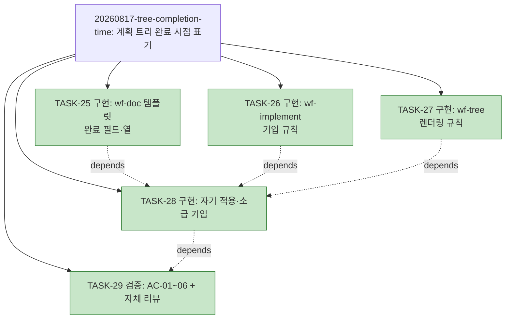

# PLAN-llm-workflow: 구현 계획

> 문서 유형: `plan`
> 작업 ID: `20260817-tree-completion-time`
> 상태: `completed`
> 기준선: `v1` ([REQ-DESIGN-tree-completion-time](./work/20260817-tree-completion-time/req-design.md), 2026-08-17 승인)
> 작성일: 2026-08-09
> 최종 갱신: 2026-08-17
> 관련 문서: [REQ-DESIGN-tree-completion-time: 요구사항·설계](./work/20260817-tree-completion-time/req-design.md), [WORK-20260817-tree-completion-time: 작업 기록](./work/20260817-tree-completion-time/work-log.md)

## 요약

- 목적: 승인된 기준선 v1에 따라 계획 트리 완료 시점 표기 규칙(스킬 문서 3개)과 자기 적용·소급 기입을 구현·검증한다.
- 현재 결론 또는 상태: **사이클 완료** — TASK-25~29 전부 완료, AC-01~06 전 항목 성공. 상세·검증은 [작업 기록](./work/20260817-tree-completion-time/work-log.md)의 완료 보고 참조.
- 다음 행동: 없음.

## 문서 연결

| 방향 | 관계 | 대상 문서 | 대상 항목 | 비고 |
|---|---|---|---|---|
| input | baseline | [REQ-DESIGN-tree-completion-time](./work/20260817-tree-completion-time/req-design.md) | FR-01~06, NFR-01~03, AC-01~06, DES-01~05 | 승인 기준선 v1 |
| output | implementation | [WORK-20260817-tree-completion-time: 작업 기록](./work/20260817-tree-completion-time/work-log.md) | document | 진행 상태·검증의 정본 |
| input | related | [WORK-20260809-claude-hooks](./work/20260809-claude-hooks/work-log.md), [WORK-20260809-dev-briefing](./work/20260809-dev-briefing/work-log.md), [WORK-20260814-wf-tree-triggers](./work/20260814-wf-tree-triggers/work-log.md), [WORK-20260814-id-item-tables](./work/20260814-id-item-tables/work-log.md), [WORK-20260814-tree-snapshot](./work/20260814-tree-snapshot/work-log.md) | document | 완료된 이전 사이클(아래 축약). 전부 이번 소급 기입(TASK-28) 대상 |

## 작업 정의

- 목표: ASCII 계획 트리 완료 라인의 우측 끝 완료 시점 표기 규칙을 스킬 3개(wf-doc·wf-implement·wf-tree)에 신설하고, plan.md에 자기 적용·소급 기입한 뒤 AC-01~06으로 검증한다.
- 범위·범위 밖·가정·위험: [기준선 문서](./work/20260817-tree-completion-time/req-design.md) 참조.
- 트리 사용 결정: **사용** — 작업 5개(3개 이상)이고 TASK-28→25·26·27, TASK-29→28 의존이 있어 채택 기준을 충족한다.

## 계획 트리

<!-- generated -->

```text
PLAN-llm-workflow
├─ [✓] 20260809-claude-hooks ............. completed (6/6, TASK-01~06) .. 2026-08-09 18:53
├─ [✓] 20260809-dev-briefing ............. completed (9/9, TASK-07~15) .. 2026-08-09 22:58
├─ [✓] 20260814-wf-tree-triggers ......... completed (4/4, TASK-16~19) .. 2026-08-14 01:02
├─ [✓] 20260814-id-item-tables ........... completed (2/2, TASK-20~21) .. 2026-08-14 02:08
├─ [✓] 20260814-tree-snapshot ............ completed (3/3, TASK-22~24) .. 2026-08-14 02:09
└─ [✓] 20260817-tree-completion-time ..... completed (5/5) ............. 2026-08-17 22:19
    ├─ [✓] TASK-25 구현: wf-doc 템플릿 완료 필드·열 ...................... 2026-08-17 22:16
    ├─ [✓] TASK-26 구현: wf-implement 기입 규칙 ......................... 2026-08-17 22:16
    ├─ [✓] TASK-27 구현: wf-tree 렌더링 규칙 ............................ 2026-08-17 22:16
    ├─ [✓] TASK-28 구현: 자기 적용·소급 기입      depends: TASK-25·26·27  2026-08-17 22:17
    └─ [✓] TASK-29 검증: AC-01~06 + 자체 리뷰     depends: TASK-28 ...... 2026-08-17 22:19
```



## 작업 목록

완료된 이전 사이클 (상세는 각 작업 기록이 정본):

- [x] TASK-01~06 — C층 훅 3종 + 설치 (작업 `20260809-claude-hooks`, [작업 기록](./work/20260809-claude-hooks/work-log.md)) — 전부 completed, 완료 2026-08-09 18:53
- [x] TASK-07~15 — 발표 자료 md→pptx, 디자인·인포그래픽 (작업 `20260809-dev-briefing`, [작업 기록](./work/20260809-dev-briefing/work-log.md)): TASK-07 md 초판 / TASK-08 내용 검토 관문 / TASK-09 테스트(Red) / TASK-10 구현(Green) / TASK-11 생성·검증 / TASK-13 디자인 테스트(Red) / TASK-14 렌더러(Green) / TASK-15 재생성·검증 / TASK-12 최종 검토 관문 — 전부 completed, 완료 2026-08-09 22:58
- [x] TASK-16~19 — wf-tree 트리거 신설(스킬 문서 3개) (작업 `20260814-wf-tree-triggers`, [작업 기록](./work/20260814-wf-tree-triggers/work-log.md)): TASK-16 wf-implement 트리거·완료 조건·용어 / TASK-17 wf-doc 템플릿 / TASK-18 wf-tree 적용 시점·description / TASK-19 검증 AC-01~06 — 전부 completed, 완료 2026-08-14 01:02
- [x] TASK-20~21 — wf-doc 템플릿 ID 발행 항목 표 형식 (작업 `20260814-id-item-tables`, [작업 기록](./work/20260814-id-item-tables/work-log.md)): TASK-20 templates.md 표 골격·노트 / TASK-21 검증 AC-01~04 — 전부 completed, 완료 2026-08-14 02:08
- [x] TASK-22~24 — 완료 사이클 트리 스냅숏 백업 규칙 + 소급 백업 2건 (작업 `20260814-tree-snapshot`, [작업 기록](./work/20260814-tree-snapshot/work-log.md)): TASK-22 스냅숏 규칙(스킬 3개) / TASK-23 소급 백업 / TASK-24 검증 AC-01~05 — 전부 completed, 완료 2026-08-14 02:09

현재 사이클 (작업 `20260817-tree-completion-time`):

### TASK-25: wf-doc 템플릿 — 완료 필드·열

- 상태: completed
- 완료: 2026-08-17 22:16
- 상위: 없음
- 목표: plan 템플릿 TASK 필드에 `- 완료:`를 `- 상태:` 바로 다음에 추가(상태 `completed`일 때만 두는 조건부 필드, 형식 `YYYY-MM-DD HH:MM`)하고 노트에 기입 조건·소유권 참조를 기록. status 템플릿 작업 목록 표를 `| 작업 ID | 제목 | 상태 | 완료 | 의존 |`로 확장(미완료 작업은 공란)
- 관련 요구사항과 설계: FR-05, DES-01·02
- 변경 대상: `skills/wf-doc/references/templates.md`
- 의존성: 없음
- 위험: 없음 (템플릿 절 내 국소 변경)
- 검증 방법: TDD 부적용(산문 문서, 테스트 체계 없음 — 후행 검증으로 대체). AC-02 기계 확인은 TASK-29
- 완료 조건: 두 템플릿에 필드·열과 노트 반영, 변경 대상 절 밖 의미 불변(NFR-02)

### TASK-26: wf-implement — 기입 규칙

- 상태: completed
- 완료: 2026-08-17 22:16
- 상위: 없음
- 목표: §3.2의 진행 상태 갱신 문장(전이·트리 재생성을 같은 변경으로 묶는 문단)에 `completed` 전이 시 같은 변경에서 완료 필드(`YYYY-MM-DD HH:MM`)를 기입한다는 규칙을 한 문장으로 추가
- 관련 요구사항과 설계: FR-03, DES-04 (배치 위치는 §3.2 — [작업 기록의 경미 정정](./work/20260817-tree-completion-time/work-log.md#설계와-달라진-점) 참조)
- 변경 대상: `skills/wf-implement/SKILL.md`
- 의존성: 없음
- 위험: 없음
- 검증 방법: AC-03 기계 확인은 TASK-29
- 완료 조건: 규칙 한 문장 반영, 소유권 경계(NFR-01) 불변

### TASK-27: wf-tree — 렌더링 규칙

- 상태: completed
- 완료: 2026-08-17 22:16
- 상위: 없음
- 목표: §7 ASCII 문단에 완료 시점 표기 규칙 신설 — 완료 라인(`[✓]`·완료 작업 노드·접힌 완료 서브트리)의 우측 끝 배치, 기존 우측 주석(`completed (n/m)` 롤업·`depends:`) 뒤 순서, 점선 리더·공백으로 형제 블록 열 정렬, 롤업 시점은 자식 최댓값 파생(표시 전용), 완료 필드 없는 항목은 시점 생략(결손 허용). §2 예시 트리에 표기 반영
- 관련 요구사항과 설계: FR-01·02·04, DES-02·03
- 변경 대상: `skills/wf-tree/SKILL.md`
- 의존성: 없음 (규칙 본문이 wf-doc 완료 필드를 링크하므로 TASK-25와 같은 세션 권장)
- 위험: RISK-03(라인 길이) — 열 정렬 규칙으로 완화
- 검증 방법: AC-01·04 기계 확인은 TASK-29
- 완료 조건: 규칙·예시 반영, 단일 소스 원칙·소유권 경계 불변

### TASK-28: 자기 적용·소급 기입

- 상태: completed
- 완료: 2026-08-17 22:17
- 상위: 없음
- 목표: 이 문서(plan.md) 작업 목록의 완료 항목에 완료 시점 기입 — 과거 사이클 5건은 [종결 커밋 시각 근사](./work/20260817-tree-completion-time/work-log.md#기준선과-현재-계획)(DES-05), 현재 사이클의 완료 TASK는 실제 완료 시각. 같은 변경에서 신규 규칙(TASK-27)으로 계획 트리 재생성
- 관련 요구사항과 설계: FR-06, DES-05, NFR-03(스냅숏 무변경)
- 변경 대상: `docs/plan.md`
- 의존성: TASK-25, TASK-26, TASK-27
- 위험: RISK-02(커밋 시각 근사 오차) — 근사 방식을 작업 기록에 명시
- 검증 방법: AC-05·06 확인은 TASK-29
- 완료 조건: 완료 항목 전부에 시점 기입 또는 결손 사유, 트리 재생성 완료, 스냅숏 무변경

### TASK-29: 검증과 자체 리뷰

- 상태: completed
- 완료: 2026-08-17 22:19
- 상위: 없음
- 목표: AC-01~04 기계 확인(세 문서 해당 절 통독), AC-05 자기 적용 확인(plan.md 트리), AC-06 스냅숏 무변경(git diff), wf-implement §3.5 자체 리뷰, 작업 기록에 검증 표(VER-01~06) 기록
- 관련 요구사항과 설계: AC-01~06, NFR-01~03
- 변경 대상: `docs/work/20260817-tree-completion-time/work-log.md` (검증 기록)
- 의존성: TASK-28
- 검증 방법: 통독·대조·git diff 결과를 검증 표로 기록
- 완료 조건: 전 AC 판정 기록, 자체 리뷰 통과

의존성 요약: TASK-25·26·27(독립, 병행 가능) → TASK-28(자기 적용) → TASK-29(검증).

## 검증 계획

AC-01~04는 TASK-25~27의 변경을 TASK-29에서 통독으로 판정한다. AC-05는 TASK-28의 재생성 결과를 규칙과 대조한다. AC-06은 `git diff`로 기존 work-log 스냅숏 절의 무변경을 확인한다. 산문 문서라 TDD를 적용하지 않으며(테스트 체계 없음), 사유는 [작업 기록](./work/20260817-tree-completion-time/work-log.md)에 남기고 후행 검증으로 대체한다. 결과는 [작업 기록 검증 절](./work/20260817-tree-completion-time/work-log.md#검증)에 기록한다.

## 마이그레이션과 롤백

소급 기입(FR-06)은 완료 항목에 대한 기록 보완이며 완료 판정·의미를 바꾸지 않는다(DES-05). 스킬 문서는 텍스트 수정만 수행하고 설치본은 정션 링크라 별도 배포 없음. 롤백은 git revert로 충분.

## 인계

작업 기록 [WORK-20260817-tree-completion-time](./work/20260817-tree-completion-time/work-log.md)의 인계 절이 정본이다.
