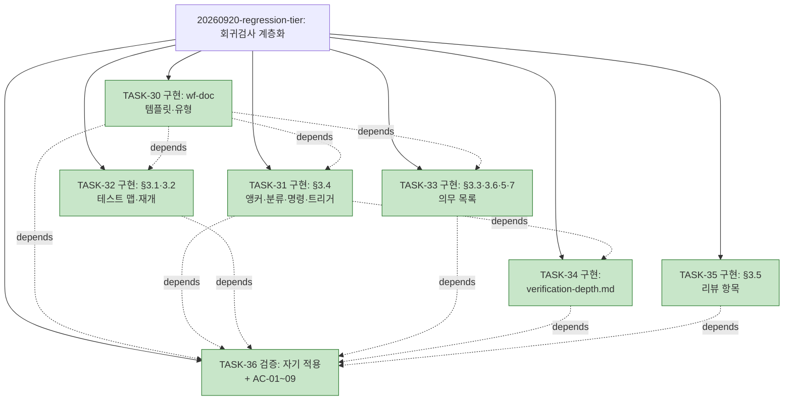

# PLAN-llm-workflow: 구현 계획

> 문서 유형: `plan`
> 작업 ID: `20260920-regression-tier`
> 상태: `completed`
> 기준선: `v1` ([REQ-DESIGN-regression-tier](./work/20260920-regression-tier/req-design.md), 2026-09-20 승인)
> 작성일: 2026-08-09
> 최종 갱신: 2026-09-20
> 관련 문서: [REQ-DESIGN-regression-tier: 요구사항·설계](./work/20260920-regression-tier/req-design.md), [ADR-004](./work/20260920-regression-tier/ADR-004-검증-결과-3튜플-앵커.md), [WORK-20260920-regression-tier: 작업 기록](./work/20260920-regression-tier/work-log.md)

## 요약

- 목적: 승인된 기준선 v1에 따라 회귀검사 계층화 — 검증 결과 3튜플 앵커, 테스트 맵, 회귀 의무 목록, 검증 계층 표(references) — 를 wf-implement·wf-doc에 구현하고 자기 적용으로 검증한다.
- 현재 결론 또는 상태: **완료** — TASK-30~36 전부 completed(2026-09-20 15:52), AC-01~09 성공. 상세는 [작업 기록](./work/20260920-regression-tier/work-log.md)이 정본.
- 다음 행동: 저장소 커밋 후 작업 기록 검증 표의 SHA 갱신. 다음 사이클(Stop 게이트·시도 등록부)은 새 요구·설계 관문부터.

## 문서 연결

| 방향 | 관계 | 대상 문서 | 대상 항목 | 비고 |
|---|---|---|---|---|
| input | baseline | [REQ-DESIGN-regression-tier](./work/20260920-regression-tier/req-design.md) | FR-01~10, NFR-01~05, AC-01~09, DES-01~08 | 승인 기준선 v1 |
| input | decision | [ADR-004: 검증 결과의 3튜플 앵커](./work/20260920-regression-tier/ADR-004-검증-결과-3튜플-앵커.md) | DES-01 | 승인된 결정 |
| output | implementation | [WORK-20260920-regression-tier: 작업 기록](./work/20260920-regression-tier/work-log.md) | document | 진행 상태·검증의 정본 |
| input | related | [WORK-20260809-claude-hooks](./work/20260809-claude-hooks/work-log.md), [WORK-20260809-dev-briefing](./work/20260809-dev-briefing/work-log.md), [WORK-20260814-wf-tree-triggers](./work/20260814-wf-tree-triggers/work-log.md), [WORK-20260814-id-item-tables](./work/20260814-id-item-tables/work-log.md), [WORK-20260814-tree-snapshot](./work/20260814-tree-snapshot/work-log.md), [WORK-20260817-tree-completion-time](./work/20260817-tree-completion-time/work-log.md) | document | 완료된 이전 사이클(아래 축약) |

## 작업 정의

- 목표: wf-doc 템플릿(분류 열·의무 목록 절·관련 테스트 필드·test-map 유형)과 wf-implement 본문(§3.1~3.6·§5·§7), 신설 `references/verification-depth.md`에 회귀 계층화 규칙을 구현하고, 이 작업의 work-log 자기 적용과 측정 스크립트로 AC-01~09를 검증한다.
- 범위·범위 밖·가정·위험: [기준선 문서](./work/20260920-regression-tier/req-design.md) 참조.
- 트리 사용 결정: **사용** — 작업 7개이고 TASK-31·32·33→30, TASK-34→31, TASK-36→30~35 의존이 있어 채택 기준을 충족한다.

## 계획 트리

<!-- generated -->

```text
PLAN-llm-workflow
├─ [✓] 20260809-claude-hooks ............. completed (6/6, TASK-01~06) .. 2026-08-09 18:53
├─ [✓] 20260809-dev-briefing ............. completed (9/9, TASK-07~15) .. 2026-08-09 22:58
├─ [✓] 20260814-wf-tree-triggers ......... completed (4/4, TASK-16~19) .. 2026-08-14 01:02
├─ [✓] 20260814-id-item-tables ........... completed (2/2, TASK-20~21) .. 2026-08-14 02:08
├─ [✓] 20260814-tree-snapshot ............ completed (3/3, TASK-22~24) .. 2026-08-14 02:09
├─ [✓] 20260817-tree-completion-time ..... completed (5/5, TASK-25~29) .. 2026-08-17 22:19
└─ [✓] 20260920-regression-tier .......... completed (7/7, TASK-30~36) .. 2026-09-20 15:52
    ├─ [✓] TASK-30 구현: wf-doc 템플릿·유형 확장 ......................... 2026-09-20 15:12
    ├─ [✓] TASK-31 구현: wf-implement §3.4 앵커·분류·명령·트리거   depends: TASK-30 .. 2026-09-20 15:20
    ├─ [✓] TASK-32 구현: wf-implement §3.1·§3.2 테스트 맵·재개     depends: TASK-30 .. 2026-09-20 15:20
    ├─ [✓] TASK-33 구현: wf-implement §3.3·§3.6·§5·§7 의무 목록     depends: TASK-30 .. 2026-09-20 15:20
    ├─ [✓] TASK-34 구현: references/verification-depth.md          depends: TASK-31 .. 2026-09-20 15:28
    ├─ [✓] TASK-35 구현: wf-implement §3.5 리뷰 항목 .................................. 2026-09-20 15:20
    └─ [✓] TASK-36 검증: 자기 적용 + AC-01~09 + 자체 리뷰           depends: TASK-30~35 .. 2026-09-20 15:52
```



## 작업 목록

완료된 이전 사이클 (상세는 각 작업 기록이 정본):

- [x] TASK-01~06 — C층 훅 3종 + 설치 (작업 `20260809-claude-hooks`, [작업 기록](./work/20260809-claude-hooks/work-log.md)) — 전부 completed, 완료 2026-08-09 18:53
- [x] TASK-07~15 — 발표 자료 md→pptx, 디자인·인포그래픽 (작업 `20260809-dev-briefing`, [작업 기록](./work/20260809-dev-briefing/work-log.md)): TASK-07 md 초판 / TASK-08 내용 검토 관문 / TASK-09 테스트(Red) / TASK-10 구현(Green) / TASK-11 생성·검증 / TASK-13 디자인 테스트(Red) / TASK-14 렌더러(Green) / TASK-15 재생성·검증 / TASK-12 최종 검토 관문 — 전부 completed, 완료 2026-08-09 22:58
- [x] TASK-16~19 — wf-tree 트리거 신설(스킬 문서 3개) (작업 `20260814-wf-tree-triggers`, [작업 기록](./work/20260814-wf-tree-triggers/work-log.md)): TASK-16 wf-implement 트리거·완료 조건·용어 / TASK-17 wf-doc 템플릿 / TASK-18 wf-tree 적용 시점·description / TASK-19 검증 AC-01~06 — 전부 completed, 완료 2026-08-14 01:02
- [x] TASK-20~21 — wf-doc 템플릿 ID 발행 항목 표 형식 (작업 `20260814-id-item-tables`, [작업 기록](./work/20260814-id-item-tables/work-log.md)): TASK-20 templates.md 표 골격·노트 / TASK-21 검증 AC-01~04 — 전부 completed, 완료 2026-08-14 02:08
- [x] TASK-22~24 — 완료 사이클 트리 스냅숏 백업 규칙 + 소급 백업 2건 (작업 `20260814-tree-snapshot`, [작업 기록](./work/20260814-tree-snapshot/work-log.md)): TASK-22 스냅숏 규칙(스킬 3개) / TASK-23 소급 백업 / TASK-24 검증 AC-01~05 — 전부 completed, 완료 2026-08-14 02:09

- [x] TASK-25~29 — 계획 트리 완료 시점 표기 규칙(스킬 3개) + 자기 적용·소급 기입 (작업 `20260817-tree-completion-time`, [작업 기록](./work/20260817-tree-completion-time/work-log.md)): TASK-25 wf-doc 템플릿 완료 필드·열 / TASK-26 wf-implement 기입 규칙 / TASK-27 wf-tree 렌더링 규칙 / TASK-28 자기 적용·소급 기입 / TASK-29 검증 AC-01~06 — 전부 completed, 완료 2026-08-17 22:19

현재 사이클 (작업 `20260920-regression-tier`):

### TASK-30: wf-doc 템플릿·유형 확장

- 상태: completed
- 완료: 2026-09-20 15:12
- 상위: 없음
- 목표: `templates.md` — verification 표에 `분류` 열 추가와 증거 필수 항목(SHA·명령) 노트(DES-06), work-log에 `## 회귀 의무 목록` 절과 상태 어휘 노트(DES-04), plan TASK 필드에 `- 관련 테스트:`(DES-02), `test-map` 유형 신설(위치·표 골격·생성 방법 노트, DES-02·07). `wf-doc/SKILL.md` §2.1 유형 표에 `test-map` 행. 목차·상태 규칙·필수 연결 표 갱신
- 관련 요구사항과 설계: FR-02·03·04·06, DES-02·04·06·07
- 변경 대상: `skills/wf-doc/references/templates.md`, `skills/wf-doc/SKILL.md`
- 의존성: 없음
- 위험: 없음 (템플릿 절 내 국소 변경, 기존 문서 비소급)
- 검증 방법: TDD 부적용(산문). AC-02·03·04의 템플릿 부분 기계 확인은 TASK-36
- 완료 조건: 네 템플릿·유형 표 반영, 변경 대상 절 밖 무변경(NFR-02)

### TASK-31: wf-implement §3.4 — 앵커·분류·명령·트리거

- 상태: completed
- 완료: 2026-09-20 15:20
- 상위: 없음
- 목표: §3.4에 3튜플 귀속·인용 조건·별개 검증 규칙(FR-01), 실패 분류의 SHA 근거 규칙(FR-03 후단), 실행 명령 고정(DES-07), `references/verification-depth.md` 트리거 문장(FR-09) 추가. 검증 표 기록 문장을 `분류` 열 포함으로 갱신
- 관련 요구사항과 설계: FR-01·02·03·09, DES-01·05·06·07
- 변경 대상: `skills/wf-implement/SKILL.md` §3.4
- 의존성: TASK-30 (템플릿 링크 대상)
- 위험: RISK-03(인용 남용) — TASK-35 리뷰 항목으로 완화
- 검증 방법: AC-01 기계 확인은 TASK-36
- 완료 조건: 규칙 문단 반영, 소유권 경계(NFR-01) 불변

### TASK-32: wf-implement §3.1·§3.2 — 테스트 맵·재개

- 상태: completed
- 완료: 2026-09-20 15:20
- 상위: 없음
- 목표: §3.1에 테스트 맵 생성·사전 실행 항목(FR-04)과 의무 목록 SHA 비교 후 재실행 항목(FR-08), §3.2에 `관련 테스트:` 채우기와 구현 중 맵 갱신 문장 추가
- 관련 요구사항과 설계: FR-04·08, DES-02·03
- 변경 대상: `skills/wf-implement/SKILL.md` §3.1, §3.2
- 의존성: TASK-30 (test-map 템플릿·plan 필드 링크)
- 위험: RISK-01(맵 누락) — §3.6 전체 스위트가 그물, 맵 밖 실패의 누락 기록 규정 포함
- 검증 방법: AC-03·06 기계 확인은 TASK-36
- 완료 조건: 두 절 반영

### TASK-33: wf-implement §3.3·§3.6·§5·§7 — 의무 목록

- 상태: completed
- 완료: 2026-09-20 15:20
- 상위: 없음
- 목표: §3.3에 시점별 실행 집합(Green·Refactor 후 = 맵)과 `completed` 전이 시 의무 목록 추가·전량 실행·회귀 사건 정의(FR-05·06), §3.6에 전체 스위트 1회 + 의무 목록(FR-05), §5 완료 조건 항목, §7 소유 파일에 `test-map.md`와 인계 절 의무 목록 상태(FR-06·08)
- 관련 요구사항과 설계: FR-05·06·08, DES-03·04
- 변경 대상: `skills/wf-implement/SKILL.md` §3.3, §3.6, §5, §7
- 의존성: TASK-30 (work-log 템플릿 절 링크)
- 위험: RISK-02(목록 비대) — 진입 조건은 TASK-34
- 검증 방법: AC-04·06 기계 확인은 TASK-36
- 완료 조건: 네 절 반영, DES-03 정정(Green·Refactor는 맵) 준수

### TASK-34: references/verification-depth.md 신설

- 상태: completed
- 완료: 2026-09-20 15:28
- 상위: 없음
- 목표: 시점별 실행 집합 표(DES-03), 경로별 검증 깊이 표(DES-08), 의무 목록 진입 조건 2회(Q-02 확정)·상태 어휘, 예산 신호 규칙(threshold 수신 후) 수록. wf-implement의 첫 references 파일
- 관련 요구사항과 설계: FR-05·07·09, DES-03·05·08
- 변경 대상: `skills/wf-implement/references/verification-depth.md` (신설)
- 의존성: TASK-31 (트리거 문장의 링크 대상)
- 위험: RISK-04(트리거 미준수) — 관찰 대상
- 검증 방법: AC-05 기계 확인은 TASK-36
- 완료 조건: 네 요소 수록, 본문과 의미 충돌 없음

### TASK-35: wf-implement §3.5 — 리뷰 항목

- 상태: completed
- 완료: 2026-09-20 15:20
- 상위: 없음
- 목표: "기존 동작에 의도하지 않은 회귀가 없는가?"를 테스트 맵·의무 목록 성공 확인으로 교체, "인용한 검증의 SHA가 HEAD와 같고 워킹트리가 clean인가" 항목 추가(RISK-03·06)
- 관련 요구사항과 설계: FR-01·05, RISK-03·06
- 변경 대상: `skills/wf-implement/SKILL.md` §3.5
- 의존성: 없음 (TASK-31·33과 같은 세션 권장)
- 위험: 없음
- 검증 방법: TASK-36
- 완료 조건: 두 항목 반영

### TASK-36: 자기 적용·검증·자체 리뷰

- 상태: completed
- 완료: 2026-09-20 15:52
- 상위: 없음
- 목표: 이 작업의 work-log에 `## 회귀 의무 목록` 절(산문 저장소 — "유지할 테스트 없음" 명시)과 새 검증 표(SHA·명령·분류)를 적용, `test-map.md`에 "관련 테스트 없음" 기록(FR-10). AC-01~06 통독 대조, AC-07 work-log 대조, AC-08 측정 스크립트 실행, AC-09 `git diff` 범위 확인. wf-implement §3.5 자체 리뷰. 완료 보고
- 관련 요구사항과 설계: AC-01~09, NFR-01~05
- 변경 대상: `docs/work/20260920-regression-tier/work-log.md`, `test-map.md`
- 의존성: TASK-30~35
- 검증 방법: 통독·대조·스크립트·git diff 결과를 검증 표로 기록
- 완료 조건: 전 AC 판정 기록, 자체 리뷰 통과

의존성 요약: TASK-30 → TASK-31·32·33 → TASK-34(←31) → TASK-36(←30~35). TASK-35 독립.

## 검증 계획

AC-01~06은 TASK-30~35의 변경을 TASK-36에서 통독으로 판정한다. AC-07은 이 작업 work-log의 절·표를 규칙과 대조하고, AC-08은 `python measure_regression_baseline.py`를 실행해 이 사이클 행의 SHA·명령 기록률을 확인하며, AC-09는 `git diff --name-only`·`git diff`로 범위 밖 무변경을 확인한다. 산문 문서라 TDD를 적용하지 않으며(테스트 체계 없음), 사유는 [작업 기록](./work/20260920-regression-tier/work-log.md)에 남기고 후행 검증으로 대체한다. 결과는 [작업 기록 검증 절](./work/20260920-regression-tier/work-log.md#검증)에 새 형식(SHA·명령·분류)으로 기록한다.

## 마이그레이션과 롤백

기존 완료 사이클의 work-log·검증 표는 소급하지 않는다(NFR-04). 스킬 문서는 텍스트 수정만 수행하고 설치본은 정션 링크라 별도 배포 없음. 롤백은 git revert로 충분. 새 열·절은 기존 문서에 영향 없음(비소급 원칙, [id-item-tables DES-05](./work/20260814-id-item-tables/req-design.md) 선례).

## 인계

작업 기록 [WORK-20260920-regression-tier](./work/20260920-regression-tier/work-log.md)의 인계 절이 정본이다.
