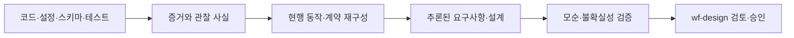

# 코드 기반 요구사항·설계 역공학 작업 정의

> 상태: 반영됨
> 작성일: 2026-08-08

> **이 문서는 기획 기록입니다.** 절차 정본은 [skills/wf-design/references/reverse-engineering.md](../../skills/wf-design/references/reverse-engineering.md)이며, 내용이 다르면 그 절차를 따릅니다.

## 요약

코드 기반 역공학은 코드에서 현재 시스템의 사실을 추출하고, 근거가 연결된 현행 요구사항과 설계를 재구성하는 작업이다.

코드는 현재 동작의 근거일 수 있지만 제품 의도나 정식 요구사항 그 자체는 아니다. 역공학 결과는 증거 기반의 현행 상태 초안이며, 정식 요구사항·설계와 기준선은 [wf-design](../../skills/wf-design/SKILL.md)의 검토와 승인을 거쳐야 한다.

## 관련 문서

- [Human–AI Development Workflow](../../README.md)
- [wf-design](../../skills/wf-design/SKILL.md)
- [wf-doc](../../skills/wf-doc/SKILL.md)
- [wf-implement](../../skills/wf-implement/SKILL.md)

## 전체 흐름



## 역공학에서 해야 할 일

| 단계 | 작업 | 주요 결과 |
|---|---|---|
| 1. 범위 확정 | 대상 저장소, 모듈, 기능, 실행 환경과 분석 깊이를 결정한다. | 분석 범위와 제외 범위 |
| 2. 기준 상태 고정 | 커밋, 브랜치, 미커밋 변경, 빌드·테스트 상태를 확인한다. | 재현 가능한 분석 기준점 |
| 3. 저장소 목록화 | 언어, 프레임워크, 진입점, 생성 코드, 외부 의존성을 파악한다. | 시스템 인벤토리 |
| 4. 실행 구조 분석 | 프로세스, 서비스, 작업, 이벤트와 요청 진입점을 추적한다. | 실행 흐름과 시스템 경계 |
| 5. 구조 복원 | 모듈·컴포넌트·계층·의존 관계와 책임을 분석한다. | 현행 아키텍처 |
| 6. 계약 추출 | API, 이벤트, 메시지, 파일 형식, CLI와 설정 계약을 분석한다. | 외부·내부 인터페이스 |
| 7. 데이터 모델 복원 | 스키마, 마이그레이션, 엔티티, 상태와 수명 주기를 분석한다. | 데이터 및 상태 모델 |
| 8. 동작 추출 | 정상·예외·실패·복구·재시도·동시성 흐름을 분석한다. | 현행 시나리오 |
| 9. 품질 속성 추출 | 인증·권한·보안·성능·호환성·로그·운영 제약을 분석한다. | 비기능 특성과 제약 |
| 10. 테스트 분석 | 테스트가 보장하는 동작, 누락 영역과 코드와의 충돌을 확인한다. | 검증 가능한 기대 동작 |
| 11. 요구사항 도출 | 외부에서 관찰할 수 있는 동작을 현행 요구사항으로 변환한다. | 역공학 요구사항 초안 |
| 12. 설계 재구성 | 요구사항을 실현하는 실제 구조·계약·흐름을 설명한다. | 현행 설계 초안 |
| 13. 모순과 공백 분석 | 코드·테스트·문서·설정 사이의 불일치와 미확인 영역을 분리한다. | 차이·질문·위험 목록 |
| 14. 동적 검증 | 안전한 빌드·테스트·실행으로 추론을 확인한다. | 실행 증거와 검증 결과 |
| 15. 추적성 구축 | 코드 증거부터 요구사항·설계까지 연결한다. | 추적표 |
| 16. 인계 | 추론과 미확정 내용을 wf-design으로 전달한다. | 검토 가능한 현행 상태 초안 |

## 증거 관리

모든 결론은 다음 단계를 거쳐야 한다.

```text
원본 증거 → 관찰 사실 → 해석 → 요구사항 또는 설계 추론
```

권장 식별자는 다음과 같다. 문자열 문법과 번호 표기는 [wf-doc 추적 식별자](../../skills/wf-doc/SKILL.md#추적-식별자)의 항목 ID 규칙을 따른다.

- `EV-01`: 코드·테스트·설정·실행 증거
- `OBS-01`: 증거에서 직접 확인한 사실
- `RR-01`: 역공학으로 추론한 현행 요구사항
- `RD-01`: 재구성한 현행 설계 요소
- `CON-01`: 서로 충돌하는 증거
- `GAP-01`: 확인하지 못한 영역

미해결 질문과 위험에는 새 접두사를 만들지 않고 wf-doc의 `Q-01`, `RISK-01`을 그대로 사용한다. 질문과 위험은 승인으로 전환되는 추론이 아니라 모든 워크플로우가 공유하는 항목이기 때문이다.

추적 관계 예시:

```text
EV-01 → OBS-01 → RR-01 → RD-01
```

`RR`, `RD` 같은 추론 식별자는 정식 `FR-*`, `DES-*`와 분리한다. wf-design 검토와 승인을 거친 후에만 정식 요구사항·설계 식별자로 전환할 수 있다.

## 신뢰도 분류

숫자 점수 대신 다음 범주를 사용한다.

| 신뢰도 | 의미 |
|---|---|
| `confirmed` | 코드나 실행 결과에서 직접 확인함 |
| `strongly-inferred` | 여러 독립적인 증거가 일치함 |
| `tentative` | 단일 증거나 간접 정황에 의존함 |
| `conflicting` | 증거끼리 충돌함 |
| `unknown` | 확인할 수 있는 근거가 부족함 |

각 추론에는 근거 위치, 해석 과정, 신뢰도와 반증 조건을 기록한다.

신뢰도는 [wf-doc 정보 성격 표지](../../skills/wf-doc/SKILL.md#25-본문-작성)(사실·해석·가정·결정·질문·위험)를 대체하지 않는 보조 속성이며, 두 분류는 다음과 같이 대응시킨다.

- `사실`로 표시한 항목에는 `confirmed`만 사용할 수 있다.
- `해석`과 `가정`에는 `strongly-inferred` 또는 `tentative`를 사용한다.
- `conflicting`인 증거는 `CON` 항목으로 분리하고 필요하면 `위험`으로도 기록한다.
- `unknown`은 `GAP` 항목 또는 `질문`으로 연결하며, 결론의 근거로 사용하지 않는다.

## 분석 원칙

### 사실과 의도 분리

- 코드에서 직접 확인한 동작과 제품이 의도했을 것으로 추론한 동작을 구분한다.
- 현재 구현을 제품 목적이나 비즈니스 요구사항으로 자동 승격하지 않는다.
- 외부에서 관찰할 수 있는 동작과 내부 구현 세부사항을 분리한다.
- 문서·주석·테스트가 현재 코드와 다르면 어느 하나를 임의로 정답으로 선택하지 않고 충돌로 기록한다.

### 점진적 분석

- 저장소 전체를 한 번에 상세 분석하지 않는다.
- 먼저 시스템 경계, 진입점과 주요 흐름을 파악한 뒤 관련 모듈을 깊게 조사한다.
- 생성 코드, 벤더 코드, 캐시와 빌드 산출물은 기본 분석 범위에서 제외하고 이유를 기록한다.
- 공개 계약, 데이터 손실 위험, 보안 경계와 핵심 업무 흐름을 우선한다.

### 안전한 동적 검증

- 정적 분석을 기본으로 하고 필요한 경우에만 빌드·테스트·로컬 실행으로 추론을 검증한다.
- 운영 시스템, 외부 사용자, 원격 저장소와 실제 데이터에 상태 변경을 일으키지 않는다.
- 분석용 계측이나 실험이 필요하면 [wf-design 프로토타입 규칙](../../skills/wf-design/SKILL.md#1-적용-시점)과 동일하게 검증하려는 가설, 범위, 폐기 여부, 성공·실패 판단 기준을 먼저 명시하고, 제품 변경과 분리된 임시·가역 환경에서 수행한다.
- 실행하지 못한 검증을 성공으로 기록하지 않는다.

## 피해야 할 오류

- 현재 존재하는 버그를 요구사항으로 승격하지 않는다.
- 사용되지 않는 코드나 도달 불가능한 분기를 실제 동작으로 간주하지 않는다.
- 함수·클래스 이름만 보고 책임을 단정하지 않는다.
- 주석과 README가 코드보다 항상 정확하다고 가정하지 않는다.
- 테스트가 존재한다는 이유만으로 현재 구현도 같은 동작이라고 단정하지 않는다.
- 구현 세부사항을 외부 요구사항으로 그대로 옮기지 않는다.
- 코드에 없는 제품 목적과 비즈니스 이유를 추측하지 않는다.
- 증거가 없다는 사실을 기능이 없다는 증거로 사용하지 않는다.
- 운영 시스템 호출, 데이터 변경, 배포 등 외부 상태 변경을 분석 권한으로 실행하지 않는다.
- 비밀 정보나 개인정보를 증거 문서에 복사하지 않는다.

## 권장 산출물

작은 시스템은 하나의 문서로 합칠 수 있고, 큰 시스템은 다음 산출물로 분리할 수 있다.

- 역공학 범위와 저장소 인벤토리
- 증거·관찰 등록부
- 현행 요구사항 초안
- 현행 SW 설계 초안
- 인터페이스·데이터 계약 목록
- 모순·공백·미해결 질문 목록
- 코드–요구사항–설계 추적표
- 동적 검증 결과
- wf-design 인계 문서

역공학을 시작할 때 [wf-design 산출물 규칙](../../skills/wf-design/SKILL.md#6-산출물)에 따라 작업 ID를 발행하고, 산출물은 `docs/work/<작업-ID>/` 아래에 유지한다.

산출물의 wf-doc 적용 범위는 다음과 같다.

- 현행 요구사항 초안과 현행 SW 설계 초안은 wf-doc의 `requirements`, `design` 유형에 `draft` 상태로 매핑한다.
- 증거·관찰 등록부, 모순·공백·질문 목록, 동적 검증 결과처럼 대응하는 wf-doc 문서 유형이 없는 산출물에는 [wf-doc 공통 머리말](../../skills/wf-doc/SKILL.md#23-공통-머리말-작성)과 하이퍼링크·식별자·상태 규칙만 적용한다. 역공학의 동적 검증은 인수 조건 검증이 아니므로 `verification` 유형을 사용하지 않는다.
- 역공학 전용 문서 유형과 `EV`, `OBS`, `RR`, `RD`, `CON`, `GAP` 식별자를 wf-doc에 정식으로 추가하는 것은 스킬화 시점에 검토한다.

## 기존 워크플로우와의 경계

| 영역 | 책임 |
|---|---|
| 코드 기반 역공학 | 현재 코드에서 사실·증거·현행 동작과 구조를 복원한다. |
| [wf-design](../../skills/wf-design/SKILL.md) | 추론을 제품 의도와 대조하고 정식 요구사항·설계로 결정·승인한다. |
| [wf-doc](../../skills/wf-doc/SKILL.md) | 역공학 산출물의 문서 구조와 연결 형식을 정의한다. |
| [wf-implement](../../skills/wf-implement/SKILL.md) | 승인된 기준선 이후 변경이 필요할 때 참여한다. |

역공학은 요구사항이나 설계를 승인하지 않는다. 현재 코드에서 확인하거나 추론한 내용을 증거 기반 초안으로 만들고 wf-design에 전달한다.

### 스킬화 시 배치

이 절차는 독립 스킬이 아니라 [design-change.md](../../skills/wf-design/references/design-change.md)와 같은 **wf-design의 참조 절차**로 편입한다. 이 결정은 [reverse-engineering.md](../../skills/wf-design/references/reverse-engineering.md)로 반영되었다.

- wf-design이 이미 [현재 상태 조사](../../skills/wf-design/SKILL.md#41-현재-상태-조사)와 요구사항·설계의 의미를 소유하며, 역공학은 그 조사를 체계화한 확장이다.
- 역공학의 최종 산출물은 wf-design 승인 관문으로 인계되는 요구사항·설계 초안이므로 소유권이 갈라지지 않는다.
- 독립 스킬로 만들면 wf-design·wf-implement·wf-doc과의 경계쌍 3개가 새로 생겨 정본·요약 동기화 부담이 늘어난다.

## 완료 조건

다음 조건을 모두 만족하면 역공학 결과를 wf-design에 인계할 수 있다. 인계 문서에는 [wf-doc 인계 블록](../../skills/wf-doc/SKILL.md#27-인계와-재개-지점-작성)을 적용한다.

- 분석 대상과 제외 범위, 저장소 기준점이 명시되어 있다.
- 주요 실행 경로, 인터페이스, 데이터와 실패·복구 흐름이 다뤄졌다.
- 주요 품질 속성과 운영 제약이 확인되었거나 미확인으로 표시되었다.
- 모든 요구사항·설계 추론이 코드 또는 실행 증거에 연결되어 있다.
- 사실, 해석, 가정과 제품 의도가 구분되어 있다.
- 각 추론에 신뢰도와 반증 조건이 기록되어 있다.
- 코드·테스트·문서·설정 사이의 모순이 숨겨지지 않았다.
- 실행하지 못한 검증과 분석하지 못한 영역이 기록되어 있다.
- 다음 담당자가 대화 기록 없이 문서만으로 검토를 계속할 수 있다.

이 문서는 역공학 절차의 작업 범위와 원칙을 정리한 기획 기록이다. 절차 정본은 [wf-design의 참조 절차](../../skills/wf-design/references/reverse-engineering.md)다.
