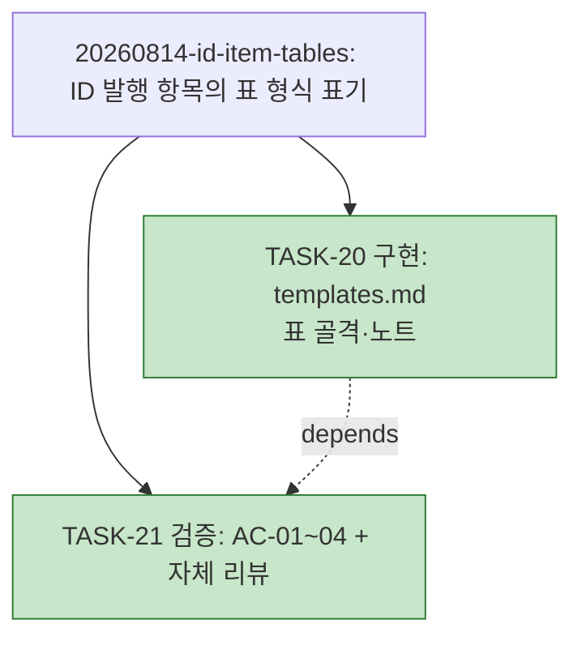

# WORK-20260814-id-item-tables: 작업 기록

> 문서 유형: `work-log, verification, completion`
> 작업 ID: `20260814-id-item-tables`
> 상태: `completed`
> 기준선: `v1` ([REQ-DESIGN-id-item-tables](./req-design.md), 2026-08-14 승인)
> 작성일: 2026-08-14
> 최종 갱신: 2026-08-14
> 관련 문서: [PLAN-llm-workflow: 구현 계획](../../plan.md)

## 요약

- 목적: ID 발행 항목의 표 형식 표기(templates.md 개정)의 진행 상태와 검증 증거를 기록한다.
- 현재 결론 또는 상태: **작업 완료** — TASK-20·21 전부 종료, AC-01~04 전 항목 성공. 완료 보고는 아래 [완료 보고](#완료-보고) 절.
- 다음 행동: 없음.

## 문서 연결

| 방향 | 관계 | 대상 문서 | 대상 항목 | 비고 |
|---|---|---|---|---|
| input | baseline | [REQ-DESIGN-id-item-tables](./req-design.md) | FR-01~03, NFR-01~02, AC-01~04, DES-01~05 | 승인 기준선 v1 |
| input | implementation | [PLAN-llm-workflow: 구현 계획](../../plan.md) | TASK-20~21 | 이 기록이 진행 상태의 정본 |

## 기준선과 현재 계획

기준선 v1([req-design.md](./req-design.md)), 계획 [TASK-20~21](../../plan.md#작업-목록). 변경 대상: `skills/wf-doc/references/templates.md`.

## 현재 상태

- 진행 중인 작업: 없음 — 작업 완료
- 마지막 완료 작업: TASK-21 — 검증과 자체 리뷰(2026-08-14)
- 차단 요인: 없음

## 계획 트리

<!-- snapshot: 2026-08-14 완료 시점 -->

> [20260814-tree-snapshot](../20260814-tree-snapshot/req-design.md) FR-05 소급 백업(2026-08-14) — 축약 직전 plan.md에서 복사. 동결 기록이며 재생성·수정하지 않는다.

```text
└─ [✓] 20260814-id-item-tables ......... completed (2/2)
    ├─ [✓] TASK-20 구현: templates.md 표 골격·노트
    └─ [✓] TASK-21 검증: AC-01~04 기계 확인 + 자체 리뷰   depends: TASK-20
```



## 수행 기록

### 2026-08-14 — 계획 수립

- 수행 내용: §3.1 재확인(기준선 v1 이후 저장소 변경 없음 — 미커밋 변경은 이 작업과 무관한 untracked 파일뿐. templates.md의 FR·NFR·AC·DES가 현재 불릿 형식임을 실측 확인, 기준선 적용 가능) 후 TASK-20·21 계획 수립. 완료 사이클 TASK-16~19는 §7 규칙으로 축약 이관.
- 결정과 이유: **트리 사용 결정 = 사용** — 작업 2개이지만 TASK-21→TASK-20 의존이 있어 채택 기준(작업 간 의존 존재) 충족. 계획 수립과 같은 변경에서 [plan.md 계획 트리](../../plan.md#계획-트리) 재생성.
- 결정과 이유(TDD): 변경 대상이 산문 스킬 문서라 자동 테스트 체계가 없음 — wf-implement §3.3에 따라 TDD 사이클 부적용 사유를 여기 남기고 후행 검증(TASK-21의 기계 확인 AC-01~03)으로 대체.
- 발견 사항(구현 재량 예정): requirements·design 템플릿의 코드 블록 뒤에는 plan 템플릿과 달리 기존 노트 불릿 목록이 없고 소유권 문단만 있음 — DES-02의 "기존 노트 불릿 목록에 추가"는 노트 목록 신설로 실현한다(코드 블록과 소유권 문단 사이). 표현 배치의 구현 세부사항으로 판단.
- 결과: 계획 수립 완료.

### 2026-08-14 — TASK-20: templates.md 표 골격·노트

- 수행 내용: `skills/wf-doc/references/templates.md` 수정 4곳 — (1) requirements 템플릿 코드 블록의 기능 요구사항·비기능 요구사항·인수 조건 절을 3열 표 골격(`| ID | 항목 | 내용 |` + 예시 행 1개)으로 교체, (2) 블록 뒤에 노트 불릿 2개 신설 — FR-02 탈출 규칙("판단 가능한 한 줄 요약" 요구 포함, RISK-02 완화)과 FR-03 RISK·Q 표 골격·"ID 발행 시" 적용 조건, (3) design 템플릿 코드 블록의 컴포넌트와 책임 절을 동일 3열 표 골격(`DES-01` 예시 행)으로 교체, (4) design 블록 뒤에 requirements 노트 참조 불릿 신설(DES-02 중복 회피).
- 결정과 이유: requirements·design 템플릿에는 plan 템플릿과 달리 기존 노트 불릿 목록이 없어 코드 블록과 소유권 문단 사이에 신설 — 계획 수립 시 예정한 표현 배치의 구현 재량(wf-implement §4.1 경미한 변경).
- 실행한 검증: 문자열 정확 일치 편집으로 변경 대상 절 밖 무변경(NFR-02) 확보. AC 판정은 TASK-21.
- 결과: 완료. 같은 변경에서 [plan.md 계획 트리](../../plan.md#계획-트리) 재생성(1/2 롤업).

### 2026-08-14 — TASK-21: 검증과 자체 리뷰

- 수행 내용: AC-01~04 기계 확인(아래 검증 표), wf-implement §3.5 자체 리뷰.
- 자체 리뷰 결과: 중대 문제 없음. FR-01~03 전부 구현 매핑 확인, 항목의 의미·ID 발행 규칙·소유권 문구 불변(NFR-01 — 노트는 "ID를 발행할 때"의 조건부 형식만 규정), 변경 대상 절 밖 무변경(NFR-02 — 편집 4곳 전부 정확 일치 치환), wf-doc SKILL.md 본문 미수정(DES-02 복제 회피), VER·TASK·ADR·DCR 형식 불변(범위 제외 준수), 기존 승인 문서 무변경(DES-05 비소급). 참조 앵커 `#요구사항-requirements`는 목차에서 기존 사용 중인 유효 앵커.
- 결과: 완료. 이 종결과 같은 변경에서 plan.md 트리 최종 재생성(2/2 롤업).

## 검증

실행 방법: 변경 후 templates.md 해당 절 통독 대조 + 기준선 문서 형식 대조 (2026-08-14, 이 세션)

| 검증 | 인수 조건 | 방법 | 결과 | 증거 |
|---|---|---|---|---|
| VER-01 | [AC-01](./req-design.md#인수-조건) | requirements 템플릿 통독 | 성공 | 119~133행: 기능 요구사항·비기능 요구사항·인수 조건 절이 `\| ID \| 항목 \| 내용 \|` 3열 표 골격(예시 행 1개) / 148행 노트: 탈출 규칙 — `#### <ID> 상세` 하위 절·앵커 연결·"판단 가능한 한 줄 요약"·목록 회귀 불허 |
| VER-02 | [AC-02](./req-design.md#인수-조건) | design 템플릿 통독 | 성공 | 166~168행: 컴포넌트와 책임 절이 동일 3열 표 골격(`DES-01` 예시 행) |
| VER-03 | [AC-03](./req-design.md#인수-조건) | 두 템플릿 노트 통독 | 성공 | 149행: `\| ID \| 위험 \| 영향 \| 완화 \|`·`\| ID \| 질문 \| 해소 조건 \|` 골격과 "ID를 발행할 때" 적용 조건, "발행하지 않는 간단한 서술 허용" / 195행: design 노트가 요구사항 노트를 참조(두 템플릿 커버, 중복 회피) |
| VER-04 | [AC-04](./req-design.md#인수-조건) | 기준선 문서 형식 대조 | 성공 | [req-design.md](./req-design.md)의 FR·NFR·AC·DES·RISK·Q 전부 새 표 형식, 탈출 규칙 사용 예 2건(FR-02 상세, DES-01 상세) — 형식의 실효성 실증 |

## 설계와 달라진 점

- 노트 목록 신설: DES-02는 "기존 노트 불릿 목록에 추가"라고 했으나 requirements·design 템플릿에는 기존 불릿 목록이 없어(소유권 문단만 존재) 코드 블록과 소유권 문단 사이에 목록을 신설했다. 표현 배치의 구현 재량으로 처리(wf-implement §4.1) — FR-02·03의 내용과 배치 의도(블록 뒤 노트)는 그대로 충족.

## 완료 보고

- 완료 상태: **완료** — 계획된 전 작업(TASK-20·21) 종료.
- 완료한 내용: wf-doc templates.md 개정 — requirements 템플릿의 FR·NFR·AC 절과 design 템플릿의 DES 절을 3열 표 골격으로 표준화, 탈출 규칙(FR-02)과 RISK·Q 표 골격·적용 조건(FR-03)을 템플릿 노트로 명문화.
- 인수 조건: AC-01~04 전부 충족 — [검증](#검증) 표 VER-01~04 참조(전 항목 성공, 미수행 없음).
- 설계와 달라진 점: [해당 절](#설계와-달라진-점) 참조 — 기록된 구현 재량(노트 목록 신설)뿐, 미승인 이탈 없음.
- 통합 상태: 로컬 작업 사본에 완결 반영(templates.md + docs 산출물). 설치본은 정션 링크라 즉시 반영. 커밋·푸시는 사용자 요청 시.
- 남은 위험·제한: 과도기 형식 이원화(RISK-03) — 기존 승인 문서는 목록 형식 유지(DES-05 비소급 원칙으로 수용, 정본은 항목의 의미). 산문 규칙이라 자동 회귀 검증 없음 — 다음 문서 작성 사이클의 자연 관찰이 보완. 좁은 화면 가독성(RISK-01)은 탈출 규칙으로 완화되나 실사용 관찰 필요.
- 후속 작업: 기존 승인 문서의 의미 불변 서식 정규화(wf-doc 단독 허용 경로)는 선택적 후속 — 다음 의미 갱신 시 또는 별도 요청 시 수행.

## 인계

- 다음 단계 또는 워크플로우: 없음 — 작업 완료
- 시작 조건: N/A
- 입력 문서와 기준선: [req-design.md v1](./req-design.md), [plan.md](../../plan.md)
- 완료된 항목: 전체 — TASK-20·21, AC-01~04 검증
- 미완료 항목: 없음
- 차단 요인: 없음
- 다음 행동: 없음 — 완료 기록 커밋으로 종결
