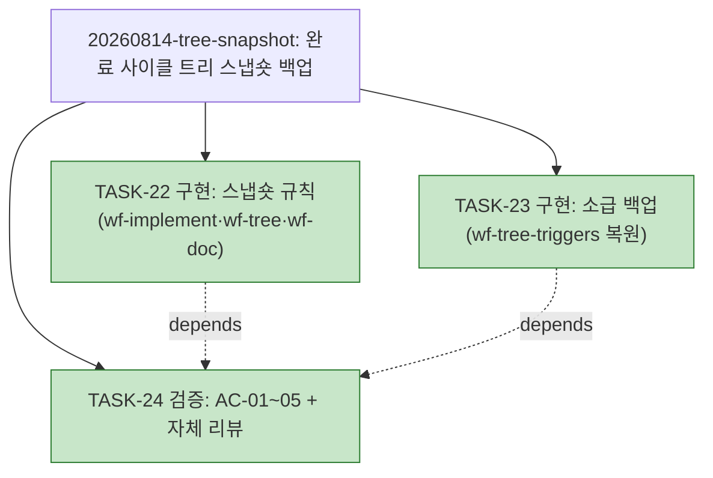

# WORK-20260814-tree-snapshot: 작업 기록

> 문서 유형: `work-log, verification, completion`
> 작업 ID: `20260814-tree-snapshot`
> 상태: `completed`
> 기준선: `v1` ([REQ-DESIGN-tree-snapshot](./req-design.md), 2026-08-14 승인)
> 작성일: 2026-08-14
> 최종 갱신: 2026-08-14
> 관련 문서: [PLAN-llm-workflow: 구현 계획](../../plan.md)

## 요약

- 목적: 완료 사이클 계획 트리 스냅숏 백업 규칙 신설과 소급 백업의 진행 상태·검증 증거를 기록한다.
- 현재 결론 또는 상태: **작업 완료** — TASK-22~24 전부 종료, AC-01~05 전 항목 성공. 완료 보고는 아래 [완료 보고](#완료-보고) 절.
- 다음 행동: 없음.

## 문서 연결

| 방향 | 관계 | 대상 문서 | 대상 항목 | 비고 |
|---|---|---|---|---|
| input | baseline | [REQ-DESIGN-tree-snapshot](./req-design.md) | FR-01~05, NFR-01~02, AC-01~05, DES-01~05 | 승인 기준선 v1 |
| input | implementation | [PLAN-llm-workflow: 구현 계획](../../plan.md) | TASK-22~24 | 이 기록이 진행 상태의 정본 |
| output | verification | [WORK-20260814-wf-tree-triggers](../20260814-wf-tree-triggers/work-log.md#계획-트리), [WORK-20260814-id-item-tables](../20260814-id-item-tables/work-log.md#계획-트리) | FR-05 | 소급 백업 대상 — 스냅숏 절 추가(기록 보완) |

## 기준선과 현재 계획

기준선 v1([req-design.md](./req-design.md)), 계획 [TASK-22~24](../../plan.md#작업-목록). 변경 대상: `skills/wf-implement/SKILL.md`, `skills/wf-tree/SKILL.md`, `skills/wf-doc/references/templates.md`, 소급 백업 work-log 2건.

## 현재 상태

- 진행 중인 작업: 없음 — 작업 완료
- 마지막 완료 작업: TASK-24 — 검증과 자체 리뷰(2026-08-14)
- 차단 요인: 없음

## 계획 트리

<!-- snapshot: 2026-08-14 완료 시점 -->

> FR-01 주 경로 — 완료 보고와 같은 변경에서 기록(AC-05 자기 적용 실증). 동결 기록이며 재생성·수정하지 않는다.

```text
└─ [✓] 20260814-tree-snapshot .......... completed (3/3)
    ├─ [✓] TASK-22 구현: 스냅숏 규칙 (wf-implement·wf-tree·wf-doc)
    ├─ [✓] TASK-23 구현: 소급 백업 (wf-tree-triggers 복원)
    └─ [✓] TASK-24 검증: AC-01~05 기계 확인 + 자체 리뷰   depends: TASK-22·23
```



## 수행 기록

### 2026-08-14 — 계획 수립

- 수행 내용: §3.1 재확인(기준선 v1 승인 직후, 저장소 변경 없음) 후 TASK-22~24 계획 수립. 완료 사이클 TASK-20~21은 §7 규칙으로 축약 이관.
- 수행 내용(FR-02 보정 경로 선적용): id-item-tables의 상세 트리가 이 계획 수립에서 새 사이클 트리로 대체되므로, **plan.md를 고치기 전에** 완료 시점 트리(ASCII 서브트리+mermaid)를 [해당 work-log의 계획 트리 절](../20260814-id-item-tables/work-log.md#계획-트리)에 `<!-- snapshot: 2026-08-14 완료 시점 -->` 표시로 선백업했다 — FR-05 소급 2건 중 1건이 이 시점에 완료(백업→대체 순서 준수).
- 결정과 이유: **트리 사용 결정 = 사용** — 작업 3개 + TASK-24의 의존이 채택 기준 충족. 계획 수립과 같은 변경에서 [plan.md 계획 트리](../../plan.md#계획-트리) 재생성.
- 결정과 이유(TDD): 변경 대상이 산문 스킬 문서·문서 기록이라 자동 테스트 체계가 없음 — wf-implement §3.3에 따라 TDD 부적용 사유를 여기 남기고 후행 검증(TASK-24 기계 확인·대조)으로 대체.
- 결과: 계획 수립 완료.

### 2026-08-14 — TASK-22: 스냅숏 규칙 수정

- 수행 내용: 스킬 문서 3개 수정 4곳 — (1) `skills/wf-implement/SKILL.md` §7에 "완료 사이클의 트리 스냅숏" 불릿 신설(FR-01 완료 시 기록, FR-02 축약 전제·보정 경로, 기록 보완 성격 명시, wf-tree·wf-doc 참조 링크), (2) 같은 문서 §5 완료 조건에 스냅숏 확인 항목 추가, (3) `skills/wf-tree/SKILL.md` §5 단일 소스 원칙에 "완료 스냅숏 예외" 문단 신설(FR-03 동결·`<!-- snapshot: -->` 표시, NFR-01 일시 공존 허용, 시점 소유권은 wf-implement), (4) `skills/wf-doc/references/templates.md` work-log 템플릿 노트에 스냅숏 절 배치·표기 불릿 추가(FR-04).
- 결정과 이유: 소유권 경계 유지 — 시점·의무는 wf-implement, 동결·표시는 wf-tree, 배치는 wf-doc에 각각 배치하고 상호 링크로 연결(DES-01). 겹치는 규칙 복제 없음.
- 결과: 완료.

### 2026-08-14 — TASK-23: 소급 백업

- 수행 내용: [wf-tree-triggers work-log](../20260814-wf-tree-triggers/work-log.md#계획-트리)에 `## 계획 트리` 절 추가 — 커밋 `13e4a72`의 plan.md에서 완료 시점 트리(ASCII 서브트리+mermaid)를 그대로 복원, `<!-- snapshot: 2026-08-14 완료 시점 -->` 표시와 소급 사유 인용문 포함(DES-02·04).
- 확인 사항: FR-05의 나머지 1건(id-item-tables)은 계획 수립 변경에서 FR-02 보정 경로로 선백업 완료([해당 절](../20260814-id-item-tables/work-log.md#계획-트리)) — 수행 기록의 계획 수립 항목 참조.
- 결과: 완료. 같은 변경에서 [plan.md 계획 트리](../../plan.md#계획-트리) 재생성(2/3 롤업).

### 2026-08-14 — TASK-24: 검증과 자체 리뷰

- 수행 내용: AC-01~04 기계 확인(아래 검증 표), AC-05 자기 적용 실증(이 완료 보고와 같은 변경에서 위 [계획 트리](#계획-트리) 스냅숏 기록), wf-implement §3.5 자체 리뷰.
- 자체 리뷰 결과: 중대 문제 없음. FR-01~05 전부 구현 매핑 확인, 변경 대상 절 밖 무변경(NFR-02 — 편집 전부 정확 일치 치환), 소유권 경계 유지(시점=wf-implement·동결=wf-tree·배치=wf-doc, 규칙 복제 없음), 참조 앵커 3종(`#단일-소스-원칙`, `#7-작업-기록과-저장-위치`, `#작업-기록-work-log`) 유효, 살아있는 트리는 plan.md 하나(NFR-01).
- 결과: 완료. 이 종결과 같은 변경에서 plan.md 트리 최종 재생성(3/3 롤업).

## 검증

실행 방법: 변경 후 세 문서 해당 절 통독·검색 + git 원본 정규식 추출 기계 대조 (2026-08-14, 이 세션)

| 검증 | 인수 조건 | 방법 | 결과 | 증거 |
|---|---|---|---|---|
| VER-01 | [AC-01](./req-design.md#인수-조건) | wf-implement §7·§5 통독 | 성공 | 358행 "완료 사이클의 트리 스냅숏" 불릿(FR-01 완료 시 기록, FR-02 축약 전제·보정 경로, 기록 보완 명시), 328행 §5 완료 조건 스냅숏 항목 |
| VER-02 | [AC-02](./req-design.md#인수-조건) | wf-tree §5 통독 | 성공 | 114행 "완료 스냅숏 예외" 문단 — `<!-- snapshot: YYYY-MM-DD 완료 시점 -->` 동결 표시, 재생성·수동 수정 금지, 일시 공존 허용(NFR-01), 시점 소유권 wf-implement |
| VER-03 | [AC-03](./req-design.md#인수-조건) | templates.md work-log 노트 통독 | 성공 | 407행 — `## 수행 기록` 앞 `## 계획 트리` 절, snapshot 표시, ASCII+mermaid, wf-tree·wf-implement 참조 링크 |
| VER-04 | [AC-04](./req-design.md#인수-조건) | `git show 13e4a72` 원본과 정규식 추출 대조(PowerShell) | 성공 | wf-tree-triggers: mermaid 14행·ASCII 서브트리 5행 IDENTICAL. id-item-tables: 축약 직전 plan.md에서 같은 세션 복사([선백업 기록](#수행-기록)) — 원본이 미커밋 상태라 git 대조 불가, 복사 시점이 대체 이전임을 수행 기록에 채증 |
| VER-05 | [AC-05](./req-design.md#인수-조건) | 완료 보고와 같은 변경에서 스냅숏 생성 관찰 | 성공 | [이 문서의 계획 트리 절](#계획-트리) — 신설 FR-01 규칙의 자기 적용 실증 |

## 설계와 달라진 점

없음 — 기준선 v1(승인 관문에서 확정된 DES-05 포함)대로 구현. 미승인 이탈 없음.

## 완료 보고

- 완료 상태: **완료** — 계획된 전 작업(TASK-22~24) 종료.
- 완료한 내용: 완료 사이클 트리 스냅숏 백업 규칙 신설 — wf-implement §7(완료 시 스냅숏·축약 전제·보정 경로)·§5(완료 조건 안전망), wf-tree §5(완료 스냅숏 예외 — 동결·표시 규칙), wf-doc work-log 템플릿(배치 노트). 소급 백업 2건 — wf-tree-triggers(git `13e4a72` 복원), id-item-tables(축약 직전 선백업).
- 인수 조건: AC-01~05 전부 충족 — [검증](#검증) 표 VER-01~05 참조(전 항목 성공, 미수행 없음).
- 설계와 달라진 점: 없음.
- 통합 상태: 로컬 작업 사본에 완결 반영(스킬 3개 + docs 산출물 + 소급 백업 work-log 2건). 설치본은 정션 링크라 즉시 반영. 커밋·푸시는 사용자 요청 시.
- 남은 위험·제한: 산문 규칙이라 자동 회귀 검증 없음 — 다음 사이클 완료 시의 자연 관찰(§5 완료 조건 안전망)이 보완. id-item-tables 스냅숏은 원본이 미커밋이라 git 대조 증거가 없음(세션 내 복사 채증으로 갈음). 트리를 쓰지 않는 계획에는 스냅숏 의무가 없음(의도된 범위).
- 후속 작업: 다음 완료 사이클에서 FR-01 주 경로의 자연 발동을 관찰하면 실사용 검증이 완결된다.

## 인계

- 다음 단계 또는 워크플로우: 없음 — 작업 완료
- 시작 조건: N/A
- 입력 문서와 기준선: [req-design.md v1](./req-design.md), [plan.md](../../plan.md)
- 완료된 항목: 전체 — TASK-22~24, AC-01~05 검증, 소급 백업 2건
- 미완료 항목: 없음
- 차단 요인: 없음
- 다음 행동: 없음 — 완료 기록 커밋으로 종결
