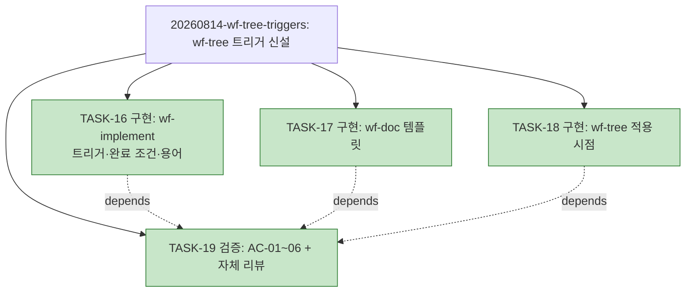

# WORK-20260814-wf-tree-triggers: 작업 기록

> 문서 유형: `work-log, verification, completion`
> 작업 ID: `20260814-wf-tree-triggers`
> 상태: `completed`
> 기준선: `v1` ([REQ-DESIGN-wf-tree-triggers](./req-design.md)·[ADR-003](./ADR-003-트리거-단일-관문.md), 2026-08-14 승인)
> 작성일: 2026-08-14
> 최종 갱신: 2026-08-14
> 관련 문서: [PLAN-llm-workflow: 구현 계획](../../plan.md)

## 요약

- 목적: wf-tree 트리거 신설(스킬 문서 3개 수정)의 진행 상태와 검증 증거를 기록한다.
- 현재 결론 또는 상태: **작업 완료** — TASK-16~19 전부 종료, AC-01~06 전 항목 성공. 완료 보고는 아래 [완료 보고](#완료-보고) 절.
- 다음 행동: 없음.

## 문서 연결

| 방향 | 관계 | 대상 문서 | 대상 항목 | 비고 |
|---|---|---|---|---|
| input | baseline | [REQ-DESIGN-wf-tree-triggers](./req-design.md) | FR-01~07, AC-01~06, DES-01~05 | 승인 기준선 v1 |
| input | implementation | [PLAN-llm-workflow: 구현 계획](../../plan.md) | TASK-16~19 | 이 기록이 진행 상태의 정본 |

## 기준선과 현재 계획

기준선 v1([req-design.md](./req-design.md), [ADR-003](./ADR-003-트리거-단일-관문.md)), 계획 [TASK-16~19](../../plan.md#작업-목록). 변경 대상: `skills/wf-implement/SKILL.md`, `skills/wf-doc/references/templates.md`, `skills/wf-tree/SKILL.md`.

## 현재 상태

- 진행 중인 작업: 없음 — 작업 완료
- 마지막 완료 작업: TASK-19 — 검증과 자체 리뷰(2026-08-14)
- 차단 요인: 없음

## 계획 트리

<!-- snapshot: 2026-08-14 완료 시점 -->

> [20260814-tree-snapshot](../20260814-tree-snapshot/req-design.md) FR-05 소급 백업(2026-08-14) — 커밋 `13e4a72`의 plan.md에서 복원. 동결 기록이며 재생성·수정하지 않는다.

```text
└─ [✓] 20260814-wf-tree-triggers ....... completed (4/4)
    ├─ [✓] TASK-16 구현: wf-implement 트리거·완료 조건·용어
    ├─ [✓] TASK-17 구현: wf-doc 템플릿 (plan 노트·죽은 필드)
    ├─ [✓] TASK-18 구현: wf-tree 적용 시점·description
    └─ [✓] TASK-19 검증: AC-01~06 기계 확인 + 자체 리뷰   depends: TASK-16~18
```



## 수행 기록

### 2026-08-14 — 계획 수립

- 수행 내용: §3.1 재확인(작업 기록 없음·신규, 기준선 이후 변경은 이 작업의 설계 문서뿐, 변경 대상 절 위치는 같은 날 검수에서 실측 확인) 후 TASK-16~19 계획 수립. 완료 사이클 TASK-07~15는 §7 규칙으로 축약 이관.
- 결정과 이유: **트리 사용 결정 = 사용** — 작업 4개(≥3) + TASK-19의 의존이 기준선 FR-01 채택 기준을 충족. 신설 규칙을 이 계획에 선적용해 [plan.md에 `## 계획 트리`를 최초 생성](../../plan.md#계획-트리)(AC-06 실증 시작, ASCII + Mermaid, `<!-- generated -->` 표시).
- 결정과 이유(TDD): 변경 대상이 산문 스킬 문서라 자동 테스트 체계가 없음 — wf-implement §3.3에 따라 TDD 사이클 부적용 사유를 여기 남기고 후행 검증(TASK-19의 기계 확인 AC-01~05)으로 대체.
- 결과: 계획 수립 완료.

### 2026-08-14 — TASK-16: wf-implement 트리거·완료 조건·용어

- 수행 내용: `skills/wf-implement/SKILL.md` 수정 4곳 — (1) §3.2에 채택 결정·최초 생성 문단 신설(183행: 결정 시점, FR-01 채택 기준, `## 계획 트리` 생성), (2) 기존 재생성 문장을 "트리를 사용하는 계획은 작업 목록이나 진행 상태를 갱신할 때 같은 변경에서 재생성"으로 확장(185행), (3) §5 완료 조건에 "트리를 사용한 계획이면 계획 트리가 작업 목록과 동기화되었다" 추가, (4) git 의미 "작업 트리" 치환 — 경계표(21행) "저장소 상태", §3.6(286행) "로컬 작업 사본".
- 발견 사항: 착수 전 전수 검색으로 git 의미 "작업 트리"가 경계표 외에 §3.6에도 1건 더 있음을 확인(기준선은 경계표만 명시) — FR-06의 목적(혼동 제거)과 AC-04(전수 0건)에 따라 함께 치환.
- 결과: 완료. 같은 변경에서 plan.md 트리 재생성(AC-06 관찰 2).

### 2026-08-14 — TASK-17: wf-doc 템플릿

- 수행 내용: `skills/wf-doc/references/templates.md` — plan 템플릿 노트에 "트리 사용 여부는 [wf-implement 계획 수립]이 결정한다" 문장 추가(353행), work-log 템플릿의 `- 작업 트리 상태:` 필드 삭제(구 367행).
- 결과: 완료.

### 2026-08-14 — TASK-18: wf-tree 적용 시점·description

- 수행 내용: `skills/wf-tree/SKILL.md` — §1 적용 시점에 "wf-implement 계획 수립이 트리 사용을 결정한 계획을 수립·갱신할 때 — TASK 작성·상태 갱신과 같은 변경에서 생성·재생성" 불릿 추가, frontmatter description에 동일 취지 한 문장 추가(하네스 중립 어휘).
- 결과: 완료. TASK-17·18 종결과 같은 변경에서 plan.md 트리 재생성(AC-06 관찰 3).

### 2026-08-14 — TASK-19: 검증과 자체 리뷰

- 수행 내용: AC-01~05 기계 확인(아래 검증 표), AC-06 관찰 증거 정리, wf-implement §3.5 자체 리뷰.
- 발견 사항(설치 반영 실증): TASK-18에서 description을 수정한 직후, 진행 중이던 실세션의 스킬 목록에 갱신된 description이 즉시 나타남 — 정션 링크 설치(기준선 DES-05의 전제)가 실측으로 확인됨.
- 자체 리뷰 결과: 중대 문제 없음. FR-01~07 전부 구현 매핑 확인, 변경 대상 절 밖 의미 불변(NFR-03), wf-tree 헌장·경계 절 무변경(NFR-01), 추가 문구는 하네스 중립(NFR-02). 구현 재량 1건은 [설계와 달라진 점](#설계와-달라진-점)에 기록.
- 결과: 완료. 이 종결과 같은 변경에서 plan.md 트리 최종 재생성(AC-06 관찰 4 — 사이클 completed 롤업 4/4).

## 검증

실행 방법: 대상 절 통독 + `skills/` 전수 검색 (2026-08-14, 이 세션)

| 검증 | 인수 조건 | 방법 | 결과 | 증거 |
|---|---|---|---|---|
| VER-01 | [AC-01](./req-design.md#인수-조건) | wf-implement §3.2 통독 | 성공 | 183행: 결정 시점("계획을 수립하거나 갱신할 때")·채택 기준(3개 이상/분해·OR-분기·의존/포트폴리오)·최초 생성("TASK를 처음 작성하는 같은 변경에서") / 185행: 상태 갱신 시 같은 변경 재생성 |
| VER-02 | [AC-02](./req-design.md#인수-조건) | wf-implement §5 통독 | 성공 | 327행 "트리를 사용한 계획이면 계획 트리가 작업 목록과 동기화되었다" |
| VER-03 | [AC-03](./req-design.md#인수-조건) | templates.md 검색·통독 | 성공 | 353행에 결정 소유자 링크 존재, `작업 트리 상태` 검색 0건 |
| VER-04 | [AC-04](./req-design.md#인수-조건) | `skills/` 전체에서 "작업 트리" 검색 | 성공 | 0건 (치환 전 3건: wf-implement 21·286행, templates 367행) |
| VER-05 | [AC-05](./req-design.md#인수-조건) | wf-tree §1·description 확인 | 성공 | §1 36행 이벤트 트리거 불릿, description 반영. 부수 증거: 실세션 스킬 목록에 갱신 description 즉시 반영(정션 링크 실증) |
| VER-06 | [AC-06](./req-design.md#인수-조건) | 이 작업의 계획으로 신설 규칙 자기 적용 관찰 | 성공 | 관찰 4회 — ①계획 수립과 같은 변경에서 `## 계획 트리` 최초 생성(`## 작업 목록` 바로 앞, `<!-- generated -->`), ②TASK-16 완료 시 재생성, ③TASK-17·18 완료 시 재생성, ④TASK-19 종결 시 재생성(4/4 롤업). [plan.md 계획 트리](../../plan.md#계획-트리) |

## 설계와 달라진 점

- FR-06의 치환어: 기준선은 "저장소 상태"로 치환한다고 명시했으나, §3.6의 "로컬 작업 트리에 변경 사항을 반영"은 문맥상 "로컬 작업 사본"이 자연스러워 그렇게 치환했다(경계표는 명시대로 "저장소 상태"). FR-06의 목적(계획 트리와의 혼동 제거)과 AC-04(전수 0건)는 그대로 충족 — 승인 범위 안의 구현 재량으로 기록(wf-implement §2.3).
- §3.6 인스턴스 자체가 기준선에 명시되지 않았던 추가 발견 — AC-04가 "skills/ 전체 0건"을 요구하므로 범위 안 확장으로 처리.

## 완료 보고

- 완료 상태: **완료** — 계획된 전 작업(TASK-16~19) 종료.
- 완료한 내용: 계획 트리 트리거 신설 — wf-implement §3.2(채택 결정·최초 생성·재생성 규칙), §5(동기화 안전망), wf-doc plan 템플릿(결정 소유자 명문화)·work-log 템플릿(죽은 필드 제거), wf-tree §1·description(이벤트 트리거). git 의미 "작업 트리" 용어 전수 정리.
- 인수 조건: AC-01~06 전부 충족 — [검증](#검증) 표 VER-01~06 참조(전 항목 성공, 미수행 없음).
- 설계와 달라진 점: [해당 절](#설계와-달라진-점) 참조 — 기록된 구현 재량(치환어 선택, §3.6 추가 치환)뿐, 미승인 이탈 없음.
- 통합 상태: 로컬 작업 사본에 완결 반영(스킬 3개 + docs 산출물). 커밋·푸시는 사용자 요청 시.
- 남은 위험·제한: 산문 규칙이라 자동 회귀 검증이 없음(RISK-02) — §5 동기화 안전망과 다음 사이클의 자연 관찰이 보완. 채택 임계값(작업 3개 이상)은 실사용 후 재보정 가능. plan.md를 §3.2 밖에서 직접 편집하는 비규정 행위는 여전히 미커버(ADR-003 감수 단점).
- 후속 작업: 다음 정식 경로 작업에서 신설 트리거의 자연 발동(계획 수립 시 트리 생성)을 관찰하면 실사용 검증이 완결된다. 별도 작업 후보(기존): SEMCo-Work C층 어댑터, B층 린트.

## 인계

- 다음 단계 또는 워크플로우: 없음 — 작업 완료
- 시작 조건: N/A
- 입력 문서와 기준선: [req-design.md v1](./req-design.md), [ADR-003](./ADR-003-트리거-단일-관문.md), [plan.md](../../plan.md)
- 완료된 항목: 전체 — TASK-16~19, AC-01~06 검증
- 미완료 항목: 없음
- 차단 요인: 없음
- 다음 행동: 없음 — 완료 기록 커밋으로 종결
