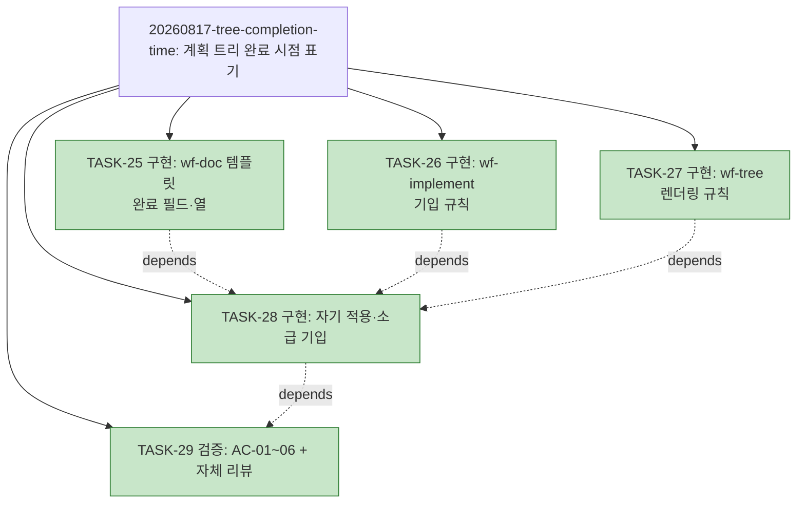

# WORK-20260817-tree-completion-time: 작업 기록

> 문서 유형: `work-log, verification, completion`
> 작업 ID: `20260817-tree-completion-time`
> 상태: `completed`
> 기준선: `v1` ([REQ-DESIGN-tree-completion-time](./req-design.md), 2026-08-17 승인)
> 작성일: 2026-08-17
> 최종 갱신: 2026-08-17
> 관련 문서: [REQ-DESIGN-tree-completion-time: 요구사항·설계](./req-design.md), [PLAN-llm-workflow: 구현 계획](../../plan.md)

## 요약

- 목적: 계획 트리 완료 시점 표기 규칙(스킬 문서 3개)과 자기 적용·소급 기입의 진행 상태·검증 증거를 기록한다.
- 현재 결론 또는 상태: **완료** — TASK-25~29 전부 완료, AC-01~06 전 항목 성공(아래 검증 표).
- 다음 행동: 없음.

## 문서 연결

| 방향 | 관계 | 대상 문서 | 대상 항목 | 비고 |
|---|---|---|---|---|
| input | baseline | [REQ-DESIGN-tree-completion-time](./req-design.md) | FR-01~06, NFR-01~03, AC-01~06, DES-01~05 | 승인 기준선 v1 |
| input | plan | [PLAN-llm-workflow: 구현 계획](../../plan.md) | TASK-25~29 | 이 작업의 계획 |

## 기준선과 현재 계획

기준선 v1(2026-08-17 승인) — Q-01 소급 포함, Q-02 날짜+시각(`YYYY-MM-DD HH:MM`). 계획은 [plan.md 작업 목록](../../plan.md#작업-목록)의 TASK-25~29 — 전부 완료.

소급 기입(DES-05)에 사용한 사이클 종결 커밋 시각(git log 실측, 2026-08-17 세션):

| 사이클 | 종결 커밋 | 시각(로컬) |
|---|---|---|
| 20260809-claude-hooks | `bd7564d` (실세션 관찰 기록으로 종결) | 2026-08-09 18:53 |
| 20260809-dev-briefing | `d8f2340` (완료 처리) | 2026-08-09 22:58 |
| 20260814-wf-tree-triggers | `13e4a72` (완료·자기 적용 검증) | 2026-08-14 01:02 |
| 20260814-id-item-tables | `3eea58d` (구현·검증 완료) | 2026-08-14 02:08 |
| 20260814-tree-snapshot | `1f7474d` (완료 기록 종결) | 2026-08-14 02:09 |

## 현재 상태

- 진행 중인 작업: 없음
- 마지막 완료 작업: TASK-29 (검증·자체 리뷰)
- 차단 요인: 없음

## 계획 트리

<!-- snapshot: 2026-08-17 완료 시점 -->

```text
└─ [✓] 20260817-tree-completion-time ..... completed (5/5) ............. 2026-08-17 22:19
    ├─ [✓] TASK-25 구현: wf-doc 템플릿 완료 필드·열 ...................... 2026-08-17 22:16
    ├─ [✓] TASK-26 구현: wf-implement 기입 규칙 ......................... 2026-08-17 22:16
    ├─ [✓] TASK-27 구현: wf-tree 렌더링 규칙 ............................ 2026-08-17 22:16
    ├─ [✓] TASK-28 구현: 자기 적용·소급 기입      depends: TASK-25·26·27  2026-08-17 22:17
    └─ [✓] TASK-29 검증: AC-01~06 + 자체 리뷰     depends: TASK-28 ...... 2026-08-17 22:19
```



## 수행 기록

### 2026-08-17 — 계획 수립

- 수행 내용: §3.1 재확인 — 이전 사이클(tree-snapshot)의 스냅숏이 [해당 work-log](../20260814-tree-snapshot/work-log.md#계획-트리)에 존재함을 확인(축약 전제 충족), 종결 커밋 시각 5건 실측(위 표). plan.md에 새 사이클(TASK-25~29) 수립, 이전 사이클(TASK-22~24) 축약, 트리 사용 결정.
- 변경 파일: `docs/plan.md`, 이 문서, `req-design.md`(문서 연결 output 행 추가)
- 결정과 이유: **트리 사용 결정 = 사용** — 작업 5개 + 의존(TASK-28→25·26·27, TASK-29→28)이 채택 기준 충족. 계획 수립 시점의 트리는 현행 규칙(완료 시점 없음)으로 생성 — 신규 규칙은 TASK-27 신설 뒤 TASK-28의 재생성부터 적용(규칙 선행 순서).
- 결과: 완료

### 2026-08-17 — TASK-25

- 수행 내용: [wf-doc plan 템플릿](../../../skills/wf-doc/references/templates.md#구현-계획-plan)의 TASK 골격에 `- 완료:` 조건부 필드(상태 다음 위치, `YYYY-MM-DD HH:MM`)와 기입 조건·소유권·파생 노트 추가, 축약형 노트에 완료 시점(사이클 단위 요약 가능) 반영. [status 템플릿](../../../skills/wf-doc/references/templates.md#포트폴리오-status)의 작업 목록 표를 `완료` 열 포함 5열로 확장하고 공란 규칙 노트 추가.
- 변경 파일: `skills/wf-doc/references/templates.md`
- 실행한 검증: TDD 부적용(산문 스킬 문서, 테스트 체계 없음) — 후행 기계 확인(VER-02)으로 대체
- 결과: 완료 (2026-08-17 22:16)

### 2026-08-17 — TASK-26

- 수행 내용: [wf-implement §3.2](../../../skills/wf-implement/SKILL.md#32-계획-수립)의 진행 상태 갱신 문단에 "`completed` 전이 시 같은 변경에서 완료 필드 기입(`YYYY-MM-DD HH:MM`, 로컬)" 한 문장 추가 — 전이·기입·트리 재생성이 한 문단에서 같은 변경으로 묶임.
- 변경 파일: `skills/wf-implement/SKILL.md`
- 결정과 이유: 기준선 DES-04의 "§3.3" 표기는 진행 상태 갱신 문장의 실제 위치(§3.2 끝)로 경미 정정 — [설계와 달라진 점](#설계와-달라진-점) 참조.
- 결과: 완료 (2026-08-17 22:16)

### 2026-08-17 — TASK-27

- 수행 내용: [wf-tree §7](../../../skills/wf-tree/SKILL.md#7-렌더링)에 **완료 시점 표기(ASCII)** 규칙 신설 — 대상 라인 3종, 완료 필드 파생(단일 소스), 기존 주석 뒤 마지막 요소 배치, 점선 리더·공백 구분과 형제 블록 열 정렬, 롤업은 자식 최댓값(표시 전용, 항목 자체 필드 우선), 결손 항목은 시점만 생략. §2 예시 트리의 `[✓]` 라인 2개에 표기 반영.
- 변경 파일: `skills/wf-tree/SKILL.md`
- 결과: 완료 (2026-08-17 22:16)

### 2026-08-17 — TASK-28

- 수행 내용: plan.md 자기 적용 — 축약된 과거 사이클 5건에 종결 커밋 시각 기입(위 표, DES-05 근사), 현재 사이클 완료 TASK에 `완료:` 필드 기입, 같은 변경에서 신규 규칙으로 계획 트리 재생성(완료 라인 우측 끝 시점 표기, 형제 블록 열 정렬).
- 변경 파일: `docs/plan.md`
- 결정과 이유: 과거 사이클의 TASK 개별 시각은 복원 비용 대비 가치가 낮아 사이클 단위 하나로 기입(TASK-25 축약형 규칙과 일치). 트리의 작업 노드 라인은 항목 자체의 완료 값을 사용.
- 결과: 완료 (2026-08-17 22:17)

### 2026-08-17 — TASK-29

- 수행 내용: AC-01~06 기계 확인(아래 검증 표), wf-implement §3.5 자체 리뷰 — 변경이 4개 파일+신규 작업 폴더에 국한, 소유권 경계 불변, 링크 앵커 유효, 범위 밖 변경 없음(미커밋 `docs/paper/`·`test.md` 보존).
- 변경 파일: 이 문서 (검증 기록·완료 보고)
- 결과: 완료 (2026-08-17 22:19)

## 검증

## 검증 범위와 환경

- 대상 기준선 또는 구현: 기준선 v1의 FR-01~06·NFR-01~03 구현(스킬 문서 3개 + plan.md 자기 적용)
- 실행 환경: 로컬 저장소 통독·`git diff` (2026-08-17 세션)
- 제외 항목: 없음

## 결과 요약

- 성공: VER-01~06 (AC-01~06 전 항목)
- 실패: 없음
- 미수행: 없음

## 인수 조건별 결과

| 검증 ID | 인수 조건 | 방법·명령 | 결과 | 증거 |
|---|---|---|---|---|
| VER-01 | [AC-01](./req-design.md#인수-조건) | wf-tree §7 통독 | 성공 | 157~162행 "완료 시점 표기(ASCII)" — 대상 라인 3종·주석 뒤 배치·열 정렬·롤업 파생·결손 생략 모두 명시, §2 예시 트리 반영 |
| VER-02 | [AC-02](./req-design.md#인수-조건) | templates.md 통독 | 성공 | 347행 `- 완료:` 골격, 366행 조건부 필드 노트(소유권·파생 링크), 369행 축약형 노트, status 표 5열 확장과 507행 공란 규칙 |
| VER-03 | [AC-03](./req-design.md#인수-조건) | wf-implement §3.2 통독 | 성공 | 185행 — `completed` 전이 시 같은 변경에서 완료 필드 기입, wf-doc 템플릿 링크 |
| VER-04 | [AC-04](./req-design.md#인수-조건) | wf-tree §7 통독 | 성공 | 162행 — 완료 필드 없는 항목은 시점만 생략·렌더링 계속, 롤업 생략 규칙 포함 |
| VER-05 | [AC-05](./req-design.md#인수-조건) | plan.md 재생성 결과 대조 | 성공 | [plan.md 계획 트리](../../plan.md#계획-트리) — 과거 사이클 5건(커밋 시각)·현재 사이클 5건(실측 시각) 전부 우측 끝 표기, 이 문서의 스냅숏이 동일 상태 보존 |
| VER-06 | [AC-06](./req-design.md#인수-조건) | `git diff --name-only` (과거 작업 폴더) | 성공 | 출력 없음 — 기존 work-log 스냅숏 5건 무변경(NFR-03) |

## 실패와 미수행 분석

없음.

## 남은 위험

- RISK-02(소급 시각의 커밋 시각 근사 오차) — 근사 방식과 커밋 해시를 이 문서에 기록해 추적 가능. 스냅숏 원 기록은 불변.

## 설계와 달라진 점

- 기준선 DES-04의 "wf-implement §3.3" 표기 — 진행 상태 갱신 문장의 실제 위치는 §3.2 계획 수립 끝부분이다. 규칙의 의도(상태 전이·기입·트리 재생성을 같은 변경으로 묶는 문장에 추가)는 불변이므로 경미한 위치 정정으로 처리하고 §3.2에 추가했다(wf-implement §4.1 경미한 변경).

## 완료 보고

### 완료 상태

- 결과: 완료
- 완료 판단 근거: TASK-25~29 전부 완료, AC-01~06 전 항목 성공(위 검증 표), 자체 리뷰 통과, 트리 스냅숏 기록([위 계획 트리 절](#계획-트리) — 신설 규칙과 스냅숏 규칙의 자기 적용).

### 완료한 내용과 주요 변경

- `skills/wf-doc/references/templates.md` — plan TASK `완료:` 조건부 필드·노트, 축약형 노트, status 작업 목록 표 `완료` 열·노트 (FR-05)
- `skills/wf-implement/SKILL.md` — §3.2 `completed` 전이 시 완료 필드 기입 규칙 (FR-03)
- `skills/wf-tree/SKILL.md` — §7 완료 시점 표기(ASCII) 규칙과 §2 예시 (FR-01·02·04)
- `docs/plan.md` — 소급 기입 5건 + 현재 사이클 자기 적용 + 트리 재생성 (FR-06)

### 통합 상태

로컬 작업 사본에 일관 반영 완료. 스킬 설치본은 정션 링크라 별도 배포 불요. 사용자 요청(2026-08-17)으로 커밋 `a4d27ca` 생성·origin/main 푸시 완료.

### 남은 위험과 제한

- 소급 시각은 종결 커밋 시각 근사(RISK-02, 위 표에 해시 기록).
- Mermaid 라벨의 완료 시점 표기는 범위 밖(기준선 범위 제외) — 필요가 확인되면 후속 작업.

## 미완료 항목

없음.

## 재개 지점

- 다음 작업: 없음 — 커밋 `a4d27ca`·푸시(origin/main)로 종결(2026-08-17).
- 먼저 확인할 사항: N/A
- 필요한 명령 또는 파일: N/A
