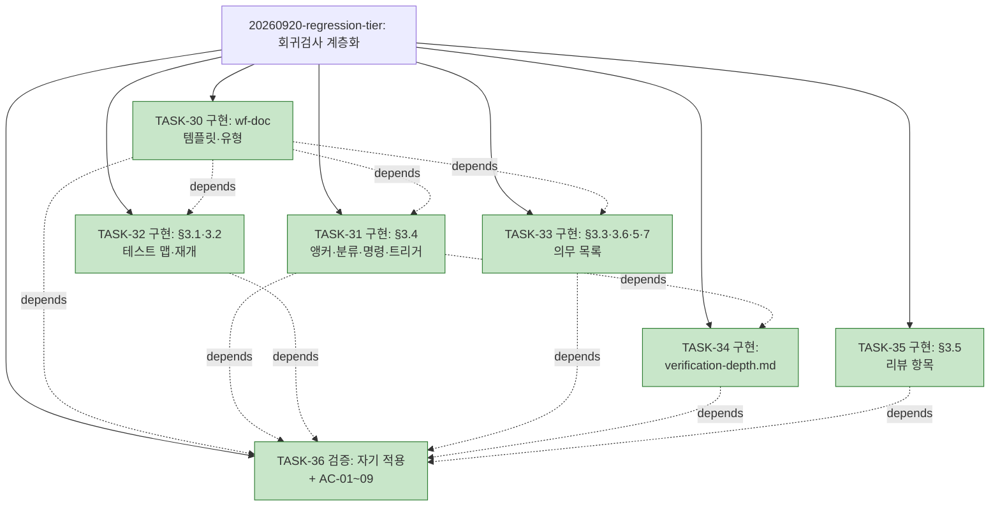

# WORK-20260920-regression-tier: 회귀검사 계층화 — 작업 기록

> 문서 유형: `work-log, verification, completion`
> 작업 ID: `20260920-regression-tier`
> 상태: `completed`
> 기준선: `v1` ([REQ-DESIGN-regression-tier](./req-design.md), 2026-09-20 승인)
> 작성일: 2026-09-20
> 최종 갱신: 2026-09-20
> 관련 문서: [REQ-DESIGN-regression-tier: 요구사항·설계](./req-design.md), [ADR-004](./ADR-004-검증-결과-3튜플-앵커.md), [TESTMAP-20260920-regression-tier](./test-map.md), [PLAN-llm-workflow: 구현 계획](../../plan.md)

## 요약

- 목적: 기준선 v1에 따라 검증 결과 3튜플 앵커, 테스트 맵, 회귀 의무 목록, 검증 계층 표를 wf-implement·wf-doc에 구현하고 자기 적용으로 검증한다.
- 현재 결론 또는 상태: **완료** — TASK-30~36 전부 완료, AC-01~09 전 항목 성공(아래 검증 표). 저장소 커밋은 사용자 요청 범위(§3.6) — 이 기록의 검증 SHA는 커밋 후 갱신 대상([발견 사항](#설계와-달라진-점) 참조).
- 다음 행동: 변경 파일을 저장소에 반영·커밋한 뒤 검증 표의 SHA를 종결 커밋으로 갱신.

## 문서 연결

| 방향 | 관계 | 대상 문서 | 대상 항목 | 비고 |
|---|---|---|---|---|
| input | baseline | [REQ-DESIGN-regression-tier](./req-design.md) | FR-01~10, NFR-01~05, AC-01~09, DES-01~08 | 승인 기준선 v1 |
| input | decision | [ADR-004](./ADR-004-검증-결과-3튜플-앵커.md) | DES-01 | 3튜플 앵커 |
| input | plan | [PLAN-llm-workflow](../../plan.md) | TASK-30~36 | 구현 계획 |
| input | related | [TESTMAP-20260920-regression-tier](./test-map.md) | 매핑 | 관련 테스트 없음(산문) |
| input | related | [기준선 1차](../20260919-aidlc-research/02_baseline_llm_workflow.md), [측정 스크립트](../20260919-aidlc-research/measure_regression_baseline.py) | §3, AC-08 | 도입 전 수치, AC-08 도구 |

## 기준선과 현재 계획

기준선 v1(2026-09-20 승인, Q-01~04 확정). 계획은 [plan.md TASK-30~36](../../plan.md#작업-목록) — 트리 사용. 의존: TASK-30 → 31·32·33 → 34(←31) → 36(←30~35), TASK-35 독립.

## 현재 상태

- 진행 중인 작업: 없음
- 마지막 완료 작업: TASK-36 (2026-09-20 15:52)
- 차단 요인: 없음

## 회귀 의무 목록

유지할 테스트 없음 — 변경 대상이 전부 산문(스킬 문서·템플릿·계획 문서)이며 이 작업이 남기는 자동 테스트가 없다([테스트 맵](./test-map.md) 참조). 저장소 기존 자동 테스트 2종은 이 작업의 변경 파일을 참조하지 않아 의무 대상이 아니다.

- 마지막 전량 재실행: 해당 없음

## 계획 트리

<!-- snapshot: 2026-09-20 완료 시점 -->

```text
└─ [✓] 20260920-regression-tier .......... completed (7/7) ............. 2026-09-20 15:52
    ├─ [✓] TASK-30 구현: wf-doc 템플릿·유형 확장 ......................... 2026-09-20 15:12
    ├─ [✓] TASK-31 구현: §3.4 앵커·분류·명령·트리거   depends: TASK-30 .. 2026-09-20 15:20
    ├─ [✓] TASK-32 구현: §3.1·§3.2 테스트 맵·재개     depends: TASK-30 .. 2026-09-20 15:20
    ├─ [✓] TASK-33 구현: §3.3·§3.6·§5·§7 의무 목록     depends: TASK-30 .. 2026-09-20 15:20
    ├─ [✓] TASK-34 구현: references/verification-depth.md  depends: TASK-31  2026-09-20 15:28
    ├─ [✓] TASK-35 구현: §3.5 리뷰 항목 ................................... 2026-09-20 15:20
    └─ [✓] TASK-36 검증: 자기 적용 + AC-01~09 + 자체 리뷰  depends: TASK-30~35  2026-09-20 15:52
```



## 수행 기록

### 2026-09-20 — 계획 수립·재확인

- 수행 내용: §3.1 재확인 — 클론 HEAD `c4cde3f`는 기준선 조사 시점과 동일, 스킬 문서 미변경, 미커밋 변경은 이 작업 산출물뿐. 테스트 맵 생성([test-map.md](./test-map.md)) — 관련 테스트 없음. 의무 목록 없음(첫 적용). plan.md TASK-30~36 정의, 20260817 사이클 축약 이관(스냅숏 존재 확인), 트리 재생성.
- 변경 파일: `docs/plan.md`, `docs/work/20260920-regression-tier/test-map.md`
- 발견 사항: 없음
- 결정과 이유: 작업 7개로 분할 — 형식(wf-doc) 먼저, 본문 절별 분리, references 신설, 자기 적용 마지막. 의존 관계는 링크 대상이 먼저 존재해야 하는 순서.
- 실행한 검증: 없음(계획 단계)
- 결과: 계획 수립 완료

### 2026-09-20 — TASK-30

- 수행 내용: `templates.md` 10곳 편집 — 목차·상태 규칙·필수 연결에 `test-map` 행, `## 테스트 맵` 절 신설(생성 정보·매핑 표·누락 기록·노트 4개), plan TASK `- 관련 테스트:` 필드와 노트, work-log `## 회귀 의무 목록` 절과 상태 어휘 노트, verification 표 `분류` 열과 증거 필수·분류 어휘 노트. `wf-doc/SKILL.md` §2.1 유형 표 `test-map` 행.
- 변경 파일: `skills/wf-doc/references/templates.md`, `skills/wf-doc/SKILL.md`
- 발견 사항: plan 템플릿 블록이 ```` ``` ````가 아닌 빈 줄+`## 검증 계획`으로 끝나 첫 편집 앵커가 빗나감(0건 매칭) — 앵커 수정 후 재적용. 편집 스크립트가 `assert count==1`로 오탐·미탐을 막았다.
- 결정과 이유: `test-map`을 work-log 절이 아닌 별도 유형·파일로(DES-02). 의무 목록의 "유지할 테스트 없음 — 사유" 한 줄 형식을 노트에 명시 — 산문 작업이 빈 표를 남기지 않도록.
- 실행한 검증: TDD 부적용(산문). AC-02·03·04 템플릿 부분은 TASK-36
- 결과: 완료 (15:12)

### 2026-09-20 — TASK-31·32·33·35

- 수행 내용: `wf-implement/SKILL.md` 14곳 편집. §3.1 두 항목(테스트 맵 생성·사전 실행, 의무 목록 SHA 비교 재실행). §3.2 `관련 테스트` 필드·맵 갱신 문장. §3.3 Green·Refactor 후 맵 실행(코드 변경 시만) 항목, `completed` 전이 의무 목록 추가·전량 실행·진입 조건 링크 문단, 회귀 사건·맵 누락 문단. §3.4 verification-depth 트리거, 3튜플 귀속·인용·명령 고정 문단, 검증 표 기록 문장(분류·SHA·명령), 실패 분류 SHA 근거 규칙. §3.5 회귀 질문 교체, 인용 SHA 항목. §3.6 전체 스위트 1회·의무 목록. §5 두 항목. §7 파일 트리 `test-map.md`, 인계 1번 의무 목록 상태.
- 변경 파일: `skills/wf-implement/SKILL.md`
- 발견 사항: §3.3 기존 항목 "각 작업 완료 시 가장 가까운 범위의 검증"이 계층 표의 Green·Refactor 행과 정확히 같은 자리 — 교체로 처리해 중복 규정을 피함. §3.4 첫 문장 "변경 위험에 비례하여"는 그대로 두고 표 참조를 6단계 목록 뒤에 배치.
- 결정과 이유: 네 TASK를 한 세션·한 편집 스크립트로 — 같은 파일의 절 간 링크가 서로를 가리키므로 분리 적용 시 중간 상태에 깨진 링크가 생긴다. plan.md의 TASK 분할은 유지(검증 단위).
- 실행한 검증: 편집 스크립트 앵커 단일 매칭 14/14. AC-01·04·06 기계 확인은 TASK-36
- 결과: 완료 (15:20)

### 2026-09-20 — TASK-34

- 수행 내용: `references/verification-depth.md` 신설 — §1 시점별 실행 집합 표(7행, Green·Refactor에서 의무 목록 미실행 사유 문단), §2 경로별 검증 깊이 표(13행, 회귀 의무 목록 행을 DES-03과 일치), 경로 판정·승격 조건 3개, §3 진입 조건(같은 SHA 2회 — Q-02)·크기 원칙·상태 어휘 4종 표·재분류 조건, §4 예산 신호 이후 규칙.
- 변경 파일: `skills/wf-implement/references/verification-depth.md` (신설)
- 발견 사항: 예산 신호 규칙에서 "의무 목록의 `completed` 전이 실행은 생략하지 않는다"를 추가 — 생략하면 다음 세션이 SHA 비교로 전량 재실행하게 되어 비용이 이월될 뿐이다. 설계 초안(플랜 §2.3 AI-05)에는 없던 항목.
- 결정과 이유: 문서 머리에 "본문과 다르면 본문 우선" 정본 선언 — wf-implement의 첫 references 파일이라 경계를 명시.
- 실행한 검증: AC-05는 TASK-36
- 결과: 완료 (15:28)

### 2026-09-20 — TASK-36

- 수행 내용: [test-map.md](./test-map.md) 작성(자기 적용 — 6파일 전부 관련 테스트 없음, 근거 기록). 이 기록을 새 형식으로 작성(의무 목록 절 "유지할 테스트 없음" 형식, 검증 표 `분류`·SHA·명령). AC-01~09 기계 확인·대조·스크립트 실행·git diff. 자체 리뷰.
- 변경 파일: `docs/work/20260920-regression-tier/work-log.md`, `test-map.md`, `docs/work/20260919-aidlc-research/measure_regression_baseline.py`(명령 인식 정규식 보정 — 측정 도구, 워크플로우 산출물 아님)
- 발견 사항: 3튜플 규칙의 첫 자기 적용에서 **미커밋 상태의 검증은 인용 불가**라는 귀결이 드러남 — 워킹트리에 변경이 있으므로 HEAD `c4cde3f`를 앵커로 쓸 수 없다. 아래 [설계와 달라진 점](#설계와-달라진-점)에 처리 기록. AC-08 첫 실행이 2/9로 나와 측정 도구 결함을 발견·보정(같은 절 3번째).
- 결정과 이유: 검증 표 증거의 SHA를 `c4cde3f+dirty`로 적고 상태를 "잠정"으로 명시. 종결 커밋 후 SHA 갱신을 인계 절의 다음 행동으로. 규칙을 우회하지 않고 규칙이 요구하는 상태(커밋)를 후속 행동으로 만드는 것이 정직한 적용.
- 실행한 검증: 아래 검증 절
- 결과: 완료 (15:52)

## 설계와 달라진 점

- **미커밋 검증의 앵커(발견, 경미).** FR-01의 인용 조건은 "SHA 일치 + 워킹트리 clean"이다. 이 작업처럼 커밋이 사용자 요청 범위에 있어 검증 시점에 워킹트리가 dirty이면, 검증 표의 SHA는 잠정값이며 인용 불가다. 기준선은 이 상황을 명시하지 않았으나 규칙의 자연스러운 귀결이므로 설계 변경이 아니다. 처리: 증거에 `c4cde3f+dirty`로 기록하고 종결 커밋 후 갱신. **후속 검토 후보**: §3.6 통합에 "커밋 후 최종 SHA로 검증 표 갱신"을 명문화할지 — 사이클 2에서 판단(경미한 명확화, DCR 불요).
- **예산 규칙 항목 추가(경미).** verification-depth.md §4에 "`completed` 전이 의무 목록 실행은 생략하지 않는다" 추가. 설계 초안에 없던 문장이나 DES-03·04의 의미 안이며 새 계약이 아니다.
- **측정 도구 보정(발견, 경미).** AC-08 첫 실행에서 이 사이클 행이 명령 기록 2/9로 산출됐다. 원인은 스크립트의 명령 인식 정규식이 `pytest|python|git|.ps1|.py` 등 키워드만 잡고 `grep`·`test` 같은 범용 셸 명령을 놓친 것(도구 결함이지 기록 결함이 아님). 처리: `measure_regression_baseline.py`의 정규식을 `grep|rg|test|ls|find|diff|sed|cat|wc`로 시작하는 백틱 문자열도 인식하도록 확장(양쪽 사본 동일), 이전 6개 사이클의 산출값이 보정 전후 동일(2/35 → 2/35)함을 확인해 기준선 1차 수치는 유지. 같은 실행에서 VER-07의 방법이 "통독"만이라 명령이 없던 것도 드러나 `grep` 명령을 부여했다 — 규칙("증거에 명령 필수")을 이 문서 자신에게 적용한 결과다.

## 검증

### 검증 범위와 환경

- 대상 기준선 또는 구현: REQ-DESIGN-regression-tier v1, 변경 파일 5개 + 신설 3개
- 실행 환경: Linux 컨테이너, 로컬 클론 HEAD `c4cde3f` + 워킹트리 변경(미커밋), Python 3, git. VER-01~09 전부 실제 실행(2026-09-20 15:35~15:52). plan.md TASK-30~36 상태·트리는 이 절 확정과 같은 변경에서 completed로 갱신
- 제외 항목: 없음

### 결과 요약

- 성공: VER-01~09 (AC-01~09 전 항목)
- 실패: 없음
- 미수행: 없음

### 인수 조건별 결과

| 검증 ID | 인수 조건 | 방법·명령 | 결과 | 분류 | 증거 |
|---|---|---|---|---|---|
| VER-01 | [AC-01](./req-design.md#인수-조건) | `grep -n "테스트 집합, 커밋 SHA, 실행 명령\|마지막 성공 SHA 이후의 변경\|기록된 형태로 실행" skills/wf-implement/SKILL.md` | 성공 | — | `c4cde3f+dirty` · 240행 귀속·인용·명령 고정 문단, 248행 분류 SHA 근거 규칙 |
| VER-02 | [AC-02](./req-design.md#인수-조건) | `grep -n "분류 \| 증거 \|\|둘 중 하나라도 없는 행은 인용\|어휘는 \[wf-implement 검증\]" skills/wf-doc/references/templates.md` | 성공 | — | `c4cde3f+dirty` · 474행 6열 표, 488·489행 노트 |
| VER-03 | [AC-03](./req-design.md#인수-조건) | `grep -n "test-map" skills/wf-doc/SKILL.md; grep -n "^## 테스트 맵\|관련 테스트: <" skills/wf-doc/references/templates.md; grep -n "test-map.md)\|관련 테스트\` 필드" skills/wf-implement/SKILL.md` | 성공 | — | `c4cde3f+dirty` · wf-doc SKILL 104행 유형, templates 322행 절·385행 필드, wf-implement 157행 §3.1·181행 §3.2 |
| VER-04 | [AC-04](./req-design.md#인수-조건) | `grep -n "^## 회귀 의무 목록" skills/wf-doc/references/templates.md; grep -n "회귀 의무 목록" skills/wf-implement/SKILL.md` | 성공 | — | `c4cde3f+dirty` · templates 419행 절; wf-implement 159(§3.1)·211(§3.3)·295(§3.6)·335(§5)·366·386(§7)행 |
| VER-05 | [AC-05](./req-design.md#인수-조건) | `test -f skills/wf-implement/references/verification-depth.md && grep -c "^## " …; grep -n "references/verification-depth.md" skills/wf-implement/SKILL.md` | 성공 | — | `c4cde3f+dirty` · 파일 존재, `## ` 절 4개(실행 집합·깊이·진입 조건·예산), 본문 238행 트리거·211행 진입 조건 링크 |
| VER-06 | [AC-06](./req-design.md#인수-조건) | `grep -n "Green을 확인한 뒤와 Refactor를 마친 뒤에는 테스트 맵\|전체 테스트 스위트를 1회\|마지막 성공 SHA와 현재 HEAD를 비교" skills/wf-implement/SKILL.md` | 성공 | — | `c4cde3f+dirty` · 201행(§3.3 맵)·295행(§3.6 전체 1회)·159행(§3.1 SHA 비교), 211행 `completed`=의무 목록 |
| VER-07 | [AC-07](./req-design.md#인수-조건) | `grep -n "^## 회귀 의무 목록\|^| 검증 ID | 인수 조건 | 방법·명령 | 결과 | 분류 | 증거 |" docs/work/20260920-regression-tier/work-log.md` + 통독 | 성공 | — | `c4cde3f+dirty` · 이 문서 [회귀 의무 목록](#회귀-의무-목록)·[검증 표](#인수-조건별-결과). 단 SHA는 잠정(`+dirty`) — [설계와 달라진 점](#설계와-달라진-점) |
| VER-08 | [AC-08](./req-design.md#인수-조건) | `python3 docs/work/20260919-aidlc-research/measure_regression_baseline.py .` | 성공 | — | `c4cde3f+dirty` · 이 사이클 행: 명령 기록 9/9, SHA 기록 9/9 (100%); 이전 6사이클 합계 2/35·1/35 불변. 첫 실행은 2/9였고 도구 보정 후 재실행 — [설계와 달라진 점](#설계와-달라진-점) 3번째 |
| VER-09 | [AC-09](./req-design.md#인수-조건) | `git diff --name-only; git diff --stat -- docs/work/2026080* docs/work/2026081*; git diff skills/wf-implement/SKILL.md \| grep '^[-+]\|'` | 성공 | — | `c4cde3f+dirty` · 변경 파일 5개(decisions·plan·wf-doc SKILL·templates·wf-implement) + 신설 3경로 — 전부 범위 내. 기존 사이클 diff 없음(빈 출력). 경계표 행 diff 없음(빈 출력) |

### 실패와 미수행 분석

없음. VER-07·08의 SHA는 워킹트리 dirty 상태의 잠정값이며, FR-01 규칙상 이 표 자체가 아직 인용 가능한 기록이 아니다. 종결 커밋 후 SHA를 갱신하면 인용 가능해진다 — 이것이 규칙의 정확한 적용이다.

### 비기능 검증

- NFR-01 소유권 경계: 경계표 diff 없음(VER-09). 의미 규칙은 wf-implement 본문, 형식은 wf-doc 템플릿에만 추가.
- NFR-02 최소 변경: 변경 대상 절 밖 문장 무변경 — diff 통독으로 확인.
- NFR-03 하네스 비의존: 추가 문장에 훅·에디터 언급 없음. `git`은 기존 전제.
- NFR-04 완료 기록 불변: VER-09 기존 사이클 diff 없음.
- NFR-05 측정 가능: VER-08.

### 남은 위험

- RISK-04 references 트리거 준수율 — 첫 references 파일. 다음 정식 사이클에서 §3.4 진입 시 `verification-depth.md`를 실제로 읽는지 관찰.
- RISK-05 산문 저장소 — 이 사이클의 검증은 형식 적용의 실증이지 회귀 시간·부정합 감소의 실증이 아니다. 코드 저장소 측정이 후속.

### 재검증 조건

종결 커밋 후 검증 표 SHA 갱신. 이후 스킬 본문·템플릿이 바뀌면 VER-01~06 재실행.

## 자체 리뷰

- 요구사항·설계: FR-01~10 전부 대응 절 존재(VER-01~08). 승인된 설계와 일치. 달라진 점 3건 기록(경미). 범위 밖 변경 없음(VER-09).
- 정확성·안정성: 산문 — 해당 없음. 링크 대상(templates 앵커·verification-depth.md)은 grep으로 존재 확인.
- 보안·운영: 비밀 정보 없음.
- 품질: 결정 사다리 — 새 파일 1개(references)만 신설, 나머지는 기존 절에 삽입. 디버그·임시 파일 없음. 인용한 검증 없음(전부 실행). 문서와 규칙 일치 — 이 기록이 새 형식을 따름(VER-07).

## 완료 보고

- 결과: 완료
- 완료 판단 근거: TASK-30~36 완료, AC-01~09 전 항목 성공, 자체 리뷰 통과, 트리 스냅숏 기록.
- 완료한 내용: 3튜플 앵커(§3.4·ADR-004), 테스트 맵(유형·템플릿·§3.1·§3.2), 회귀 의무 목록(절·§3.3·§3.6·§5·§7), 검증 계층·깊이 표(`references/verification-depth.md` + 트리거), 실패 분류 열, §3.5 리뷰 항목, 자기 적용.
- 주요 변경: `skills/wf-implement/SKILL.md`(14곳), `skills/wf-implement/references/verification-depth.md`(신설), `skills/wf-doc/references/templates.md`(10곳), `skills/wf-doc/SKILL.md`(1행), `docs/plan.md`, `docs/decisions.md`, 이 작업 폴더 4파일.
- 설계와 달라진 점: 3건(경미) — 위 절. 이 중 측정 도구 보정은 AC-08 첫 실행 실패(2/9)에서 나온 것으로, 도구를 고친 뒤 재실행해 통과했다.
- 인수 조건 충족 여부: AC-01~09 전부 충족.
- 검증 결과와 증거: 위 검증 표. SHA는 잠정.
- 통합 상태: 로컬 클론 워킹트리에 완결 반영. 저장소 커밋·푸시는 사용자 요청 범위(§3.6) — 연결 복구 후 저장소 파일과 대조하여 반영 예정.
- 남은 위험과 제한: RISK-04·05. 실측 효과는 코드 저장소 사이클에서.
- 후속 작업: (1) 종결 커밋 후 검증 표 SHA 갱신, (2) 사이클 2 — Stop 게이트·시도 등록부·보안 게이트(플랜 AI-07·09·11·12), (3) 코드 저장소 정량 기준선(기준선 1차 §4), (4) §3.6에 "커밋 후 SHA 갱신" 명문화 검토.

## 미완료 항목

없음.

## 재개 지점

- 다음 작업: 없음 — 작업 완료. 저장소 반영·커밋 후 검증 표 SHA 갱신만 남음
- 먼저 확인할 사항: 저장소의 `skills/wf-implement/SKILL.md`·`skills/wf-doc/references/templates.md`·`skills/wf-doc/SKILL.md`·`docs/plan.md`·`docs/decisions.md`가 클론 HEAD `c4cde3f`와 동일한지(사용자 편집 유무) 대조 후 덮어쓰기
- 필요한 명령 또는 파일: 이 폴더의 4파일, 위 변경 파일 5개, 신설 `references/verification-depth.md`, 보정된 `20260919-aidlc-research/measure_regression_baseline.py`
- 회귀 의무 재실행: 해당 없음(유지할 테스트 없음)
