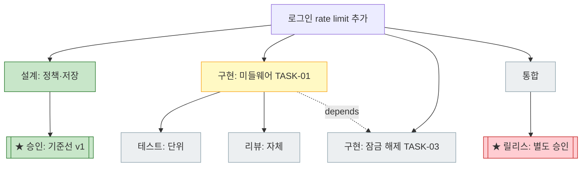

# wf-tree — 작업 계획 트리

목적: 작업 계획을 트리로 구조화하고, 누락되기 쉬운 action item을 제안하며, 전체 계획과 진행 상태를 화면에 시각화한다.

## 헌장과 역할 경계

이 스킬의 헌장은 **제안하되 결정하지 않는다**이다. 트리는 계획의 새로운 원천이 아니라 기존 계획 문서의 구조화·시각화 계층이다.

> **정본:** 이 절이 wf-tree와 wf-design·wf-implement·wf-doc 사이 경계의 정본이다. 경계쌍 동기화 부담을 줄이기 위해 상대 스킬에는 별도 경계 요약을 두지 않는다.

| 영역 | 소유 |
|---|---|
| 어떤 항목이 존재하고 완료됐는지 (의미·채택·상태 전이) | [wf-design](../wf-design/SKILL.md)(설계·승인) / [wf-implement](../wf-implement/SKILL.md)(구현·검증) |
| 트리 구조 규칙, 노드 유형, 분기 템플릿, 렌더링, 포트폴리오 구조 | 이 스킬 |
| 문서 형식, 식별자 문법, 상태 어휘 | [wf-doc](../wf-doc/SKILL.md) — 재사용, 복제하지 않음 |

경계 적용 규칙:

1. 트리에 항목을 추가하거나 제안하는 것은 요구사항·설계·계획의 승인을 대신하지 않는다.
2. 분기 템플릿의 제안은 후보일 뿐이며, 채택 여부는 내용 소유자와 사용자가 결정한다.
3. 트리 갱신은 내용 소유자가 판정한 상태를 기록할 뿐, 상태를 만들지 않는다.
4. 계획 항목의 의미를 바꿔야 하면 wf-implement로, 요구사항·설계를 바꿔야 하면 wf-design으로 반환한다.
5. 문서 골격·식별자·링크 규칙은 wf-doc을 따르고 이 스킬에서 다시 정의하지 않는다.

## 1. 적용 시점

다음 상황에서 이 스킬을 사용한다.

- 여러 작업을 하나의 목표로 묶어 계획·추적할 때 (포트폴리오)
- 한 작업의 계획을 트리로 구조화하고 시각화할 때
- 진행 현황("지금 어디까지 왔는지")을 화면에서 확인할 때
- 세션 재개 시 계획 상태를 빠르게 파악할 때

## 2. 트리 모델

트리는 두 계층으로 구성한다.

- **상위 계층(포트폴리오):** 노드 = 작업(작업 ID) 1개. 큰 목표가 작업들로 분해되는 구조.
- **하위 계층(작업 내부):** 노드 = action item. 각 작업이 통과하는 단계와 실행 단위.

```text
[포트폴리오] 인증 시스템 개선 (PF-auth-improvement)
├─ [작업] 20260808-login-rate-limit ......... in-progress (3/7)
│   ├─ [✓] 설계: 정책·저장 방식
│   ├─ [✓] 승인: 기준선 v1
│   ├─ [▶] 구현: 미들웨어 (TASK-01)
│   │   ├─ [ ] 테스트: 단위
│   │   └─ [ ] 리뷰: 자체 리뷰
│   └─ [ ] 검증: AC 판정 (VER-01)
├─ [작업] 20260815-session-store ............ pending  depends: rate-limit
└─ [작업] 20260820-2fa ...................... pending
```

구조 규칙:

- 작업이 하나뿐이면 포트폴리오 계층을 생략하고 작업을 루트로 사용할 수 있다.
- **AND-분기** (기본): 분해 — 모든 자식이 완료돼야 부모가 완료된다.
- **OR-분기**: 대안 경쟁 — `결정(ADR)` 노드가 해소하며, 기각된 대안도 삭제하지 않고 흐리게 보존한다.
- **잎** = action item. 하나의 명확한 결과와 완료 조건을 가진 실행 단위([wf-implement 계획 수립](../wf-implement/SKILL.md#32-계획-수립)과 동일 기준).
- **부모-자식 ≠ 의존성:** 부모-자식은 분해 관계, `depends:`는 순서 제약이다. 트리로 표현할 수 없는 가지 간 의존은 `depends:` 주석과 점선 간선으로 표현한다.
- 깊이는 제한하지 않는다. 가독성은 [렌더링 규칙](#7-렌더링)으로 해결한다.

## 3. 노드 유형

| 유형 | 설명 | 기존 생태계 매핑 |
|---|---|---|
| `investigate` 조사 | 현재 상태 조사, 역공학, 재현 | [wf-design §4.1](../wf-design/SKILL.md#41-현재-상태-조사), [역공학 절차](../wf-design/references/reverse-engineering.md) |
| `design` 설계 | 구조·계약·데이터 설계 | `DES-NN` |
| `decide` 결정 | 대안 비교·선택. OR-분기의 해소 지점 | `ADR-NNN` |
| `approve` 승인 ★ | 사용자 승인 관문 (기준선·범위·외부 작업) | `APR`, [wf-design §8](../wf-design/SKILL.md#8-사용자-승인-관문) |
| `prototype` 실험 | 가설 검증용 임시 구현 (폐기 전제) | [프로토타입 규칙](../wf-design/SKILL.md#1-적용-시점) |
| `implement` 구현 | 코드·테스트·설정 변경 | `TASK-NN` |
| `test` 테스트 | 구현 활동으로서의 테스트 작성·실행 | [wf-implement §3.4](../wf-implement/SKILL.md#34-검증) 1~3단계 |
| `review` 리뷰 | 설계 일관성 검토 / 구현 자체 리뷰 | [wf-design §4.5](../wf-design/SKILL.md#45-일관성-검토), [wf-implement §3.5](../wf-implement/SKILL.md#35-자체-리뷰) |
| `verify` 검증 | 인수 조건 판정 (test와 구분: AC 기준 판정) | `VER-NN` ↔ `AC-NN` |
| `document` 문서화 | 요구사항·설계·운영 문서 갱신 | [wf-doc](../wf-doc/SKILL.md) |
| `integrate` 통합 | 빌드·회귀·일관 반영 | [wf-implement §3.6](../wf-implement/SKILL.md#36-통합) |
| `migrate` 전환 | 데이터·설정 마이그레이션 + 롤백 준비 | [wf-implement §3.2](../wf-implement/SKILL.md#32-계획-수립) |
| `release` 릴리스 ★ | push·PR·배포 — 외부·비가역, 별도 승인 필수 | [wf-implement §2.3](../wf-implement/SKILL.md#23-자율-진행과-승인) |
| `change` 설계 변경 | 구현 중 기준선 충돌 시 DCR 분기 | `DCR-NNN`, [DCR 절차](../wf-design/references/design-change.md) |
| `question` 질문/차단 | 사용자 답변·외부 요인 대기 | `Q-NN`, `blocked` |

## 4. 분기 템플릿 — 누락 항목 자동 제안

노드를 추가하면 유형별로 표준 자식을 **제안**한다. 제안은 후보로 표시하며, 채택 여부는 내용 소유자와 사용자가 결정한다. 제안 규칙은 전부 기존 워크플로우 규칙에서 파생된다.

| 트리거 | 자동 제안되는 자식 | 근거 규칙 |
|---|---|---|
| `design` 노드 생성 | `review`(일관성 검토) + `approve`(승인 관문) | wf-design §4.5, §8 |
| 대안이 2개 이상 경쟁 | `decide`(ADR) OR-분기 | wf-design §3.3 |
| `implement` 노드 생성 | `test` + `review`(자체 리뷰) | wf-implement §2.4, §3.5 |
| 공개 인터페이스·계약 변경 | `document` + `verify`(호환성) | wf-implement §3.3 |
| `migrate` 노드 생성 | 롤백 준비 + `verify` **필수** | wf-implement §3.2 |
| `release` 노드 생성 | 부모에 `approve`(외부 작업 승인) **필수 게이트** | wf-implement §2.3 |
| 구현 중 기준선 충돌 감지 | `change`(DCR) 분기 + 영향 서브트리 보류 표시 | wf-implement §4.2 |
| 신뢰 경계의 입력 처리 | `test`(보안 케이스) | wf-implement §2.4 최소화 예외 영역 |
| 포트폴리오 최초 생성 | `approve`(범위 승인) **필수 게이트** | [§8 포트폴리오 생성과 갱신](#8-포트폴리오-생성과-갱신) |

필수 게이트로 표시된 제안(`migrate`의 검증, `release`·포트폴리오의 승인)은 생략을 제안하지 않는다. 사용자가 명시적으로 제외하면 제외 사실과 이유를 계획에 기록한다.

## 5. 데이터 모델과 식별자

### 단일 소스 원칙

진실의 원천은 계획 문서의 항목 목록 하나다. 트리는 항목의 `상위:` 필드에서 파생되고, 다이어그램은 목록에서 매번 재생성한다. 생성된 표현에는 `<!-- generated -->` 표시를 두고 손으로 고치지 않는다. 다이어그램과 목록이 다르면 목록이 맞다.

### 평면 ID + 상위 필드

계층을 ID에 박아 넣는 점 표기(`TASK-01.2`)는 사용하지 않는다. 트리 재구성 시 ID가 바뀌어 wf-doc의 식별자 안정성 원칙과 충돌하고 기존 링크를 깨뜨리기 때문이다. 평면 ID를 유지하고 `상위:` 필드로 분해 관계를 기록한다. 필드 표기는 [wf-doc 구현 계획 템플릿](../wf-doc/references/templates.md#구현-계획-plan)을 따른다.

### 저장 위치

- **포트폴리오:** `docs/work/PF-<슬러그>/portfolio.md` — [wf-doc `portfolio` 유형](../wf-doc/references/templates.md#포트폴리오-portfolio)을 따른다. `PF-<슬러그>` 식별자 문법은 [wf-doc 추적 식별자](../wf-doc/SKILL.md#추적-식별자)를 따른다.
- **작업 내부 트리:** 해당 작업 `plan.md`의 `## 계획 트리` 절에 생성물로 둔다. 별도 파일을 만들지 않는다.

## 6. 상태와 롤업

- 새 상태 어휘를 발명하지 않고 [wf-doc 상태값](../wf-doc/SKILL.md#24-상태-기록)을 재사용한다: `pending` / `in-progress` / `completed` / `blocked`, 승인 노드는 `awaiting-approval` / `approved` / `rejected` / `on-hold`.
- 부모 노드의 집계(`3/7 완료`, `⚠ blocked 1`)는 **표시 전용 롤업**이다. 집계가 문서의 상태 필드를 자동으로 바꾸지 않으며, 부모의 실제 완료 판정은 내용 소유자가 한다.
- OR-분기에서 기각된 대안은 삭제하지 않고 기각 표시로 보존한다.

## 7. 렌더링

### 매체 — ASCII + Mermaid 2종

| 매체 | 역할 |
|---|---|
| Markdown 목록 | 진실의 원천. 직접 수정 대상 |
| ASCII 트리 | 터미널 기본 출력. 어디서나 렌더 |
| Mermaid | 계획·포트폴리오 문서 안에 생성물로 삽입 |

HTML 등 저장소 밖 산출물은 사용하지 않는다. git 추적이 안 되어 단일 소스 원칙과 어긋나고 실행 환경 간 이식성을 해치기 때문이다.

Mermaid 표기 규칙: 상태를 `classDef`(completed·in-progress·pending·gate)로 구분하고, 승인·릴리스 게이트는 이중 테두리(`[[...]]`)와 ★로 표시하며, `depends:` 관계는 점선 간선으로 그린다.



### 갱신 시점

각 작업 완료를 포함해 계획의 진행 상태가 갱신될 때마다 같은 변경에서 트리 표현을 자동으로 재생성한다. 상태 갱신과 재렌더를 한 동작으로 묶어 이중 소스 위험을 줄인다.

### 대형 트리 대응

깊이를 제한하지 않는 대신 "전부 보여주되 전부 펼치지 않는다"를 적용한다.

1. **완료 서브트리 자동 접기** — 완료된 가지는 `[✓] 설계 단계 (4/4)` 한 줄로 요약. 펼침은 요청 시.
2. **활성 경로 중심 뷰(기본값)** — 루트→진행 중 노드 경로만 전체 깊이로 펼치고 나머지 가지는 깊이 1 요약.
3. **계층별 다이어그램 분할** — 포트폴리오 뷰(작업 노드만)와 작업별 상세 뷰를 별도 Mermaid로 생성한다. 하나의 다이어그램이 **노드 30을 초과하면 분할**한다.
4. **ASCII 필터** — 전체 / 진행 중 경로만 / 남은 항목만 / 특정 가지만.
5. **롤업 배지** — 접힌 가지에도 `(완료/전체)`와 `⚠ blocked N`을 병기해 상태 손실을 막는다.

## 8. 포트폴리오 생성과 갱신

- **최초 생성:** 사용자 승인 관문을 거친다(범위 승인). 대화형 승인 요청에는 목표, 작업 분해안(각 작업의 제목과 한 줄 범위), 작업 간 의존, 먼저 시작할 작업을 요약하고 이 분해를 포트폴리오로 확정할지 명시적으로 묻는다. 승인 결과는 포트폴리오 문서의 승인 기록에 남긴다.
- **이후 갱신:** 작업 추가·제거, 상태 반영, 트리 재구성은 승인 없이 자동으로 진행한다.
- 자동 갱신은 포트폴리오 **표현**에 한정된다. 개별 작업의 기준선 승인 관문([wf-design §8](../wf-design/SKILL.md#8-사용자-승인-관문))과 외부·비가역 작업의 별도 승인([wf-implement §2.3](../wf-implement/SKILL.md#23-자율-진행과-승인))을 대체하지 않는다.
- 포트폴리오에 추가된 작업은 각자 wf-design → 승인 → wf-implement의 정식 경로 또는 경량 경로를 따른다. 포트폴리오 등재가 작업 승인을 의미하지 않는다.

## 9. 자체 검토

트리를 생성하거나 갱신한 뒤 확인한다.

- 트리가 계획 문서의 항목 목록과 일치하는가? (다르면 목록이 맞다)
- 생성된 표현에 `<!-- generated -->` 표시가 있는가?
- 필수 게이트(`approve`·`release`·`migrate` 검증)가 누락되거나 임의로 생략되지 않았는가?
- 롤업 집계가 문서의 상태 필드를 바꾸지 않았는가?
- OR-분기의 기각 대안이 삭제되지 않고 보존되었는가?
- 노드 30 초과 다이어그램이 분할되었는가?
- `상위:`(분해)와 `depends:`(순서)가 혼동 없이 기록되었는가?
- 세션 재개 시 활성 경로 뷰만으로 "지금 어디"를 알 수 있는가?
